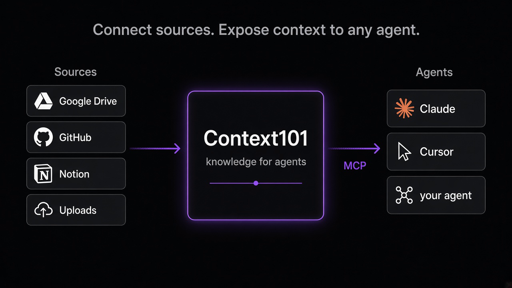

<p align="center">
  
</p>

# Context101

## What it is

A thin self-hostable wrapper around Amazon Bedrock Knowledge Bases — S3 + S3 Vectors, Better Auth + Postgres, and MCP for agents. You run it in your own AWS account.

The CLI is the front door. Deploying a space ships the admin UI with the stack.

## How it works

<p align="center">
  
</p>

<p align="center">Connect docs from Google, GitHub, Notion, or uploads. Agents pull that context over MCP.</p>

Example: analytics event docs live as markdown in your repo. Instead of emailing them around so everyone pastes into Claude, Cursor, or Grok, connect the repo to a brain and share that brain’s MCP URL. Same context for the whole team; doc updates land on the next sync (~6h).

## Install

```bash
npm i -g context101-cli
```

That installs the `context101` command. Needs Node 20+, npm, AWS CLI v2, Docker, and an AWS account with Bedrock access.

## Quick start

`context101 init` prompts for a space name. Lowercase letters, numbers, and hyphens; start with a letter.

```bash
context101 init
```

Or pass a name:

```bash
context101 init my-team
```

That writes `~/.context101/spaces/<name>/`. When you run it in a terminal, it asks whether to deploy. After deploy, open the admin URL from `context101 urls` and create the first admin.

```bash
context101 list
context101 urls my-team
context101 update my-team
context101 destroy my-team --dry-run
context101 connectors setup google
```

`list`, `urls`, `help`, `version`, and `destroy --dry-run` work without a checkout. An existing `cdk/.deploy-env` is the `default` space.

To update an existing space to the newest Context101, upgrade the CLI (`npm i -g context101-cli`), then run `context101 update <space>`.

Deploy is a quiet `deploying…` spinner. `--verbose` dumps cdk / npm / docker. `-v` is version, not verbose. Never run bare `cdk deploy`. Never print deploy-env or MCP bearers.

## Brains

You can create multiple brains for different topics or projects. Each is isolated — its own sources and docs — with its own MCP URL (`/brain/<id>/mcp`). Create brains in the admin, connect sources, then point the MCP client at that brain’s URL.

## Parked features

- Wiki generation — [WIKI_PARKED.md](./WIKI_PARKED.md)
- Conflicts detection — [ALPHA.md](./ALPHA.md)

## License

Copyright (c) 2026 Context101 contributors.

Context101 is licensed under the [Elastic License 2.0](./LICENSE). You can self-host it and use it privately or internally. Offering Context101 as a paid hosted or managed service to third parties is not allowed.

[SECURITY.md](./SECURITY.md) · [CONTRIBUTING.md](./CONTRIBUTING.md) · [CLI flags](./packages/cli/README.md)
