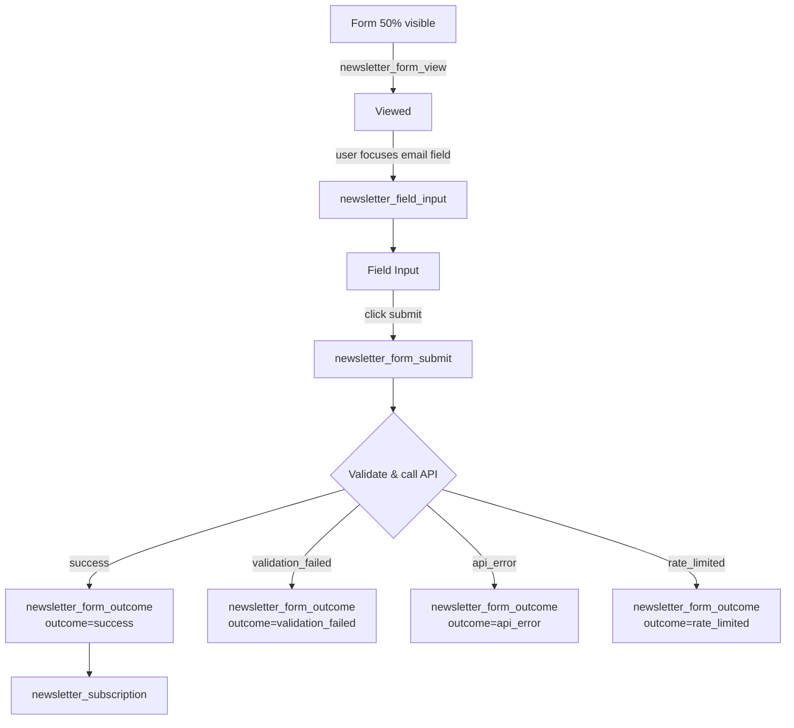

# Analytics & Event Tracking

This page documents Google Analytics 4 (GA4) event tracking for Platea, specifically covering the newsletter / email capture forms on **plateapr.com**. It describes the five form placements, the funnel of events they emit, the parameter schema attached to every event, and how the final snake_case implementation maps back to the original PascalCase brainstorm spec.

For the tooling used to query this data from LLMs, see [Google Analytics MCP Server](mcp/google-analytics-mcp.md).

Sources: [google-analytics-events.md]()

---

## Placements

Newsletter/email capture forms are instrumented across five placements on plateapr.com. All five placements from the original spec are live or in flight — nothing is missing.

| Spec placement | `placement` value | Notes |
|---|---|---|
| Header (homepage hero) | `homepage_hero` | Called "HEADER" in the spec; in practice the hero at the top of the homepage ("Menos ruido. Más contexto."). |
| Footer | `footer` | The form at the bottom of every page. |
| Email page (`/email/`) | `email_page` | Dedicated email landing page with a signup form at the top. |
| Article | `article` | Inline form placed inside article posts. |
| Subscription page (`/suscripciones`) | `subscription_page` | Hero form on the dedicated subscribe page. |

The email page and the article placement share the same underlying form component (the `pocillo-newsletter` block). They are distinguished in reporting via the `placement` value, set automatically based on where the form is rendered.

Sources: [google-analytics-events.md]()

---

## The Event Funnel

Each placement emits up to five events as the user progresses through the funnel. The diagram below shows the state transitions and which events fire.



- On a **successful** subscribe you will see **3 events in quick succession**: `newsletter_form_submit` → `newsletter_form_outcome` (outcome = success) → `newsletter_subscription`.
- On a **failure** you will see **2 events**: `newsletter_form_submit` → `newsletter_form_outcome` (with a failure outcome).

Sources: [google-analytics-events.md]()

### When each event fires

| Event | Fires when |
|---|---|
| `newsletter_form_view` | The form becomes at least 50% visible on screen. Fires once per page load. |
| `newsletter_field_input` | User clicks into or types in the email field for the first time. Fires once per page load. |
| `newsletter_form_submit` | User clicks the submit button. Fires before validation runs — this is the "attempt". |
| `newsletter_form_outcome` | System has finished processing the attempt. Always fires after a submit, with an `outcome` value explaining what happened. |
| `newsletter_subscription` | Email was valid and successfully added to Iterable. **This is the conversion event.** |

Sources: [google-analytics-events.md]()

---

## PascalCase Spec → snake_case GA4 Mapping

The original brainstorm used PascalCase event names (`FormViewed`, `FieldInputted`, etc.). The final implementation keeps the same funnel but uses GA4-native snake_case event names. The original PascalCase intent is still recorded on every event as the `form_event_type` parameter, so both vocabularies remain queryable.

| Original spec name | GA4 event name | `form_event_type` value |
|---|---|---|
| FormViewed | `newsletter_form_view` | `viewed` |
| FieldInputted | `newsletter_field_input` | `field_input` |
| FormSubmitted | `newsletter_form_submit` | `submit_attempt` |
| FormOutcomeReceived | `newsletter_form_outcome` | `validated` |
| Iterable subscribe event | `newsletter_subscription` | `subscribed` |

Sources: [google-analytics-events.md]()

---

## Parameter Schema ("formContext")

Every event carries a consistent set of parameters so reports can slice and filter the same way across the funnel.

| Parameter | Registered as custom dimension? | What it tells you |
|---|---|---|
| `placement` | Yes | Which placement: `homepage_hero`, `footer`, `email_page`, `article`, `subscription_page`. |
| `form_id` | Yes | Unique ID for the specific form instance on the page. |
| `form_event_type` | Yes | Funnel stage: `viewed`, `field_input`, `submit_attempt`, `validated`, `subscribed`. |
| `event_label` | Yes | Human-readable form label (e.g. "Footer Newsletter Form"). Preserved for continuity with legacy reports. |
| `form_name` | No (plain parameter) | Same human label as `event_label` for most placements. Only differs on the subscription page (`Suscripciones Hero` vs. `Suscripciones Page`). |
| `form_type` | No | Always `email_capture`. Reserved for future form categories. |

### Extra parameters on `newsletter_form_outcome`

| Parameter | Registered? | Values |
|---|---|---|
| `outcome` | Yes | `success`, `validation_failed`, `api_error`, `rate_limited`. |
| `rejection_reason` | Yes | Why the email was rejected — e.g. `client_regex` (invalid format), `suggested_correction` (typo detected, suggestion offered), `api_invalid` (validation API rejected it), or a specific reason string from the API. Only present when `outcome` is not `success`. |

Sources: [google-analytics-events.md]()

### Registered custom dimensions (final list)

| Dimension | Scope | Used by |
|---|---|---|
| `event_label` | Event | All 5 events |
| `event_label` | User | All 5 events |
| `form_event_type` | Event | All 5 events |
| `form_id` | Event | All 5 events |
| `outcome` | Event | `newsletter_form_outcome` only |
| `placement` | Event | All 5 events |
| `rejection_reason` | Event | `newsletter_form_outcome` only (when `outcome != success`) |

`form_name`, `form_type`, and the two editable block title/description fields are sent on every event but are **not** registered as custom dimensions. They remain accessible in GA4 Explore and BigQuery exports; if needed in standard reports, register them in GA4 Admin — no developer work required.

Sources: [google-analytics-events.md]()

---

## Differences vs. the Original Spec

- **Event names are snake_case, not PascalCase.** GA4 convention. The original PascalCase names are preserved as the `form_event_type` parameter so both schemas are queryable.
- **`event_label` now fires on all 5 events**, not just the subscribe event. Existing filters on `newsletter_subscription` still work; the same filter can now be applied across the rest of the funnel.
- **`rate_limited` is a new `outcome` value** that did not exist in the brainstorm. It surfaces when someone clicks submit more than once in a 3-second window.
- **The email page and the article placement share the same underlying form component** (the `pocillo-newsletter` block). They are distinguished in reporting via the `placement` value (`email_page` vs `article`).

Sources: [google-analytics-events.md]()

---

## Suggested GA4 Funnel Exploration

Build a **Funnel exploration** in GA4 Explore with these steps:

1. `newsletter_form_view`
2. `newsletter_field_input`
3. `newsletter_form_submit`
4. `newsletter_subscription`

Break down by `placement` to compare performance across the five placements. The gap between step 3 and step 4 is where validation rejections and API errors happen — use `newsletter_form_outcome` with `outcome != success` to see why people drop off.

To filter by placement in any report or Explore, use the `placement` dimension with the exact values: `homepage_hero`, `footer`, `email_page`, `article`, `subscription_page`.

Sources: [google-analytics-events.md]()

---

## Querying the Data via MCP

The team runs an MCP server that exposes Google Analytics data to LLMs, so you can ask natural-language questions about these events instead of building a report. Relevant tools include:

- `run_report` — runs a GA4 report via the Data API.
- `run_realtime_report` — realtime reporting.
- `get_custom_dimensions_and_metrics` — lists the registered custom dimensions for a property (useful to confirm the dimensions above are live).
- `get_account_summaries`, `get_property_details` — account/property metadata.

Sample prompts that are relevant to newsletter tracking:

```
what are the most popular events in my Google Analytics property in the last 180 days?
what are the custom dimensions and custom metrics in my property?
```

Full setup (Python/pipx, ADC, required OAuth scope `https://www.googleapis.com/auth/analytics.readonly`, and MCP server config) is documented in [Google Analytics MCP Server](mcp/google-analytics-mcp.md).

Sources: [mcp/google-analytics-mcp.md]()

---

## Summary

Newsletter tracking on plateapr.com is a five-step GA4 funnel (`view` → `field_input` → `submit` → `outcome` → `subscription`) emitted consistently across five placements. Every event carries a shared `formContext` payload (`placement`, `form_id`, `form_event_type`, `event_label`, `form_name`, `form_type`), with `outcome` and `rejection_reason` added on the outcome event. The snake_case GA4 event names map cleanly to the original PascalCase spec through the `form_event_type` parameter, so both naming conventions work in reports. The GA MCP server provides an LLM-friendly path to query this data directly.

Sources: [google-analytics-events.md](), [mcp/google-analytics-mcp.md]()