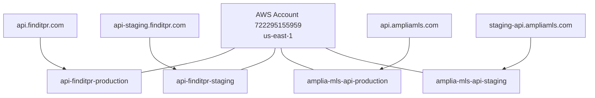

# AWS Infrastructure

This page documents the shared AWS infrastructure backing the **Findit** (`finditpr.com`) and **Amplia MLS** (`ampliamls.com`) APIs. Both products share the same AWS account and region, and their HTTP APIs are served by AWS Lambda functions mapped to per-environment domains. For broader product context and how to connect other tools (Metabase, Iterable, GA), see [General Knowledge](general-knowledge.md).

Platea is operated by the same team but has its own AWS profile (`plateapr.com`); the Lambda ARNs listed here apply only to Findit and Amplia MLS.

Sources: [infra/findit-and-amplia-aws.md](), [general-knowledge.md]()

## Account and Region

All Findit and Amplia MLS Lambda functions live in a single AWS account and region:

| Setting | Value |
| --- | --- |
| AWS Account | `722295155959` |
| Region | `us-east-1` |
| AWS CLI profile | `finditpr.com` |

Findit and Amplia share the same AWS infrastructure, so the `finditpr.com` CLI profile is used to access resources for both products. Platea uses a separate `plateapr.com` profile.

Sources: [infra/findit-and-amplia-aws.md](), [general-knowledge.md]()

## Lambda ARNs by Domain

Each public API domain is backed by a dedicated Lambda function. Staging and production are isolated as separate functions rather than aliases.

| Domain | Environment | Lambda ARN |
| --- | --- | --- |
| `api.finditpr.com` | FindIt production | `arn:aws:lambda:us-east-1:722295155959:function:api-finditpr-production` |
| `api-staging.finditpr.com` | FindIt staging | `arn:aws:lambda:us-east-1:722295155959:function:api-finditpr-staging` |
| `api.ampliamls.com` | Amplia MLS production | `arn:aws:lambda:us-east-1:722295155959:function:amplia-mls-api-production` |
| `staging-api.ampliamls.com` | Amplia MLS staging | `arn:aws:lambda:us-east-1:722295155959:function:amplia-mls-api-staging` |

These ARNs are primarily useful when debugging infrastructure issues (e.g., inspecting logs, invoking functions directly, or tracing deployments).

Sources: [infra/findit-and-amplia-aws.md]()

## Domain-to-Lambda Mapping

The diagram below visualizes how each public domain routes to its Lambda function within the shared account.



Sources: [infra/findit-and-amplia-aws.md]()

## Accessing the Infrastructure

AWS CLI access is profile-scoped per product group. Findit and Amplia MLS share the `finditpr.com` profile, while Platea uses `plateapr.com`.

```bash
# Findit + Amplia MLS (shared infra)
aws lambda get-function \
  --function-name api-finditpr-production \
  --profile=finditpr.com

# Platea
aws ... --profile=plateapr.com
```

Because Findit and Amplia MLS share the same account, a single `finditpr.com` profile is sufficient to reach all four Lambdas listed above.

Sources: [general-knowledge.md](), [infra/findit-and-amplia-aws.md]()

## Summary

The Findit and Amplia MLS APIs run entirely on AWS Lambda in `us-east-1` under account `722295155959`, with one Lambda per domain/environment pair. Platea is intentionally out of scope for this page — it uses its own AWS profile and is not covered by the ARN table above.

Sources: [infra/findit-and-amplia-aws.md](), [general-knowledge.md]()