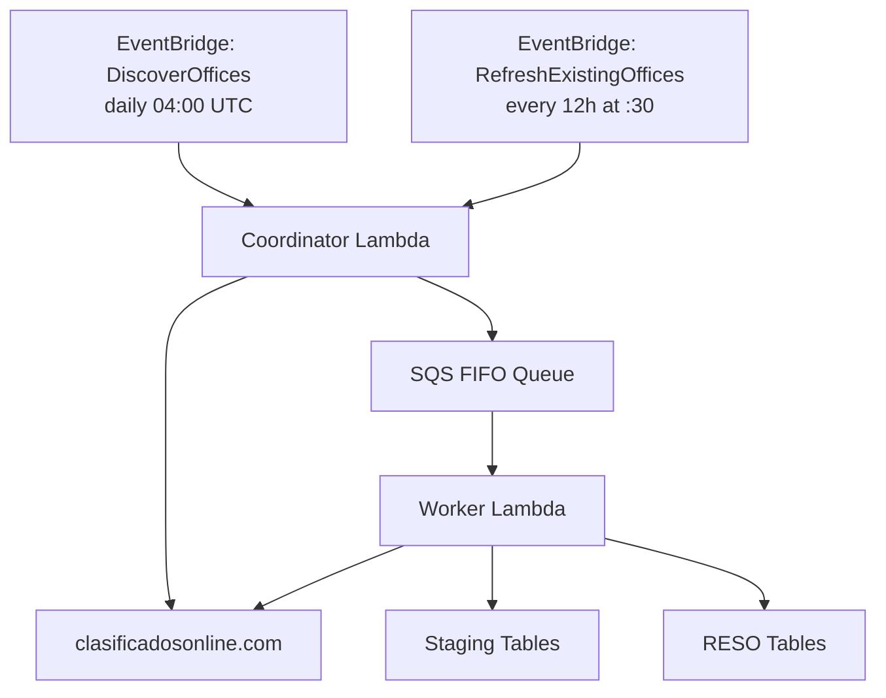
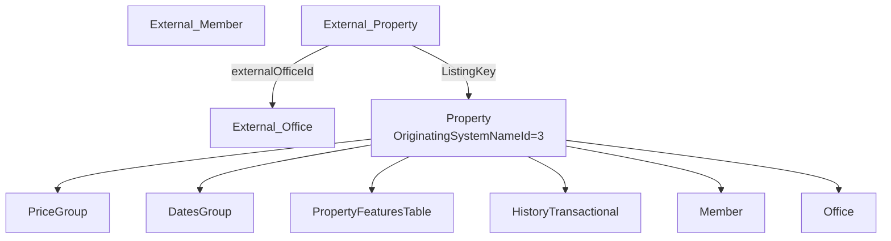
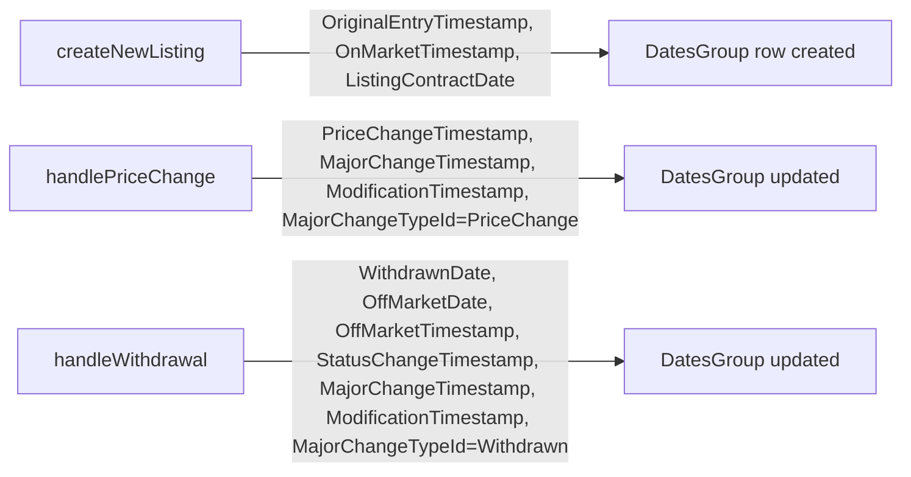
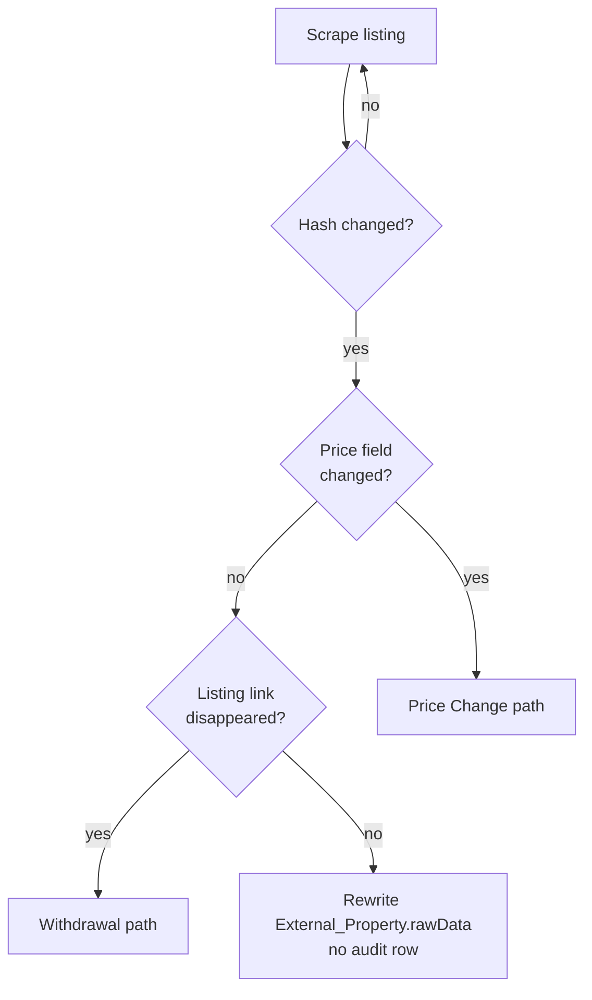

# Clasificados Online Ingestion Pipeline

An automated scraping pipeline that ingests residential property listings from [clasificadosonline.com](https://www.clasificadosonline.com) into the Amplia MLS database. The pipeline runs as an AWS Lambda pair fronted by an SQS FIFO queue, scrapes brokerage-office listing pages, and writes both a raw staging layer and the canonical RESO layer. This page documents the architecture, data flow, lifecycle states, and change-audit model end to end.

For the broader Amplia schema (RESO `Property`, `Member`, `Office`, the EAV feature pattern, etc.) this pipeline writes into, see [amplia-mysql.md](amplia-mysql.md).

Sources: [databases/clasificados-online.md](), [databases/amplia-mysql.md]()

## Architecture Overview

The pipeline is split into two Lambdas connected by an SQS FIFO queue, driven by two EventBridge schedules:

- **Coordinator Lambda** — discovers brokerage offices and dispatches them to the SQS FIFO queue.
- **Worker Lambda** — consumes one office at a time, scrapes its listings, and writes RESO rows.



Two EventBridge schedules drive scraping:

| Schedule | Cadence | Behavior |
| --- | --- | --- |
| `DiscoverOffices` | daily at 04:00 UTC | Walks the CO main page, finds new brokerage offices, refreshes listing counts, enqueues offices with `totalListings > 0`. |
| `RefreshExistingOffices` | every 12h at :30 | Dispatches every `External_Office` with `scrapingStatus = 'ACTIVE'` without touching the CO main page. |

Freshness bound: listings are refreshed at most every ~12h. Brand-new brokerage offices appear only on the daily `DiscoverOffices` run (or by manual seeding).

Sources: [databases/clasificados-online.md]()

## Data Layers

CO data is persisted in two layers:

1. **Staging layer** (raw scrape state): `External_Office`, `External_Member`, `External_Property`.
2. **RESO layer** (clean, queryable): standard Amplia tables (`Property`, `Member`, `Office`, `PriceGroup`, `DatesGroup`, `MediaGroup`, `PropertyFeaturesTable`, `HistoryTransactional`, etc.) with `OriginatingSystemNameId = 3`.



The canonical CO filter is `OriginatingSystemNameId = 3`. The `AMPLIA_OriginatingSystem` reference mapping is:

| Id | Name |
| --- | --- |
| 1 | Keller Williams |
| 2 | AMPLIA (native) |
| 3 | ClasificadosOnline |

Every row in `External_Office`, `External_Member`, and `External_Property` is CO by definition, so the filter is unnecessary on staging tables.

**Join bridge from CO ID to RESO ListingKey:**

```sql
External_Property.ListingKey = Property.ListingKey
```

`External_Property.externalSourceId` is the human-readable CO listing ID visible in the URL (`detail.asp?ID=12345`).

Sources: [databases/clasificados-online.md](), [databases/amplia-mysql.md]()

## Key Timestamps

All timestamps are stored as UTC. Convert to AST for display with `CONVERT_TZ(ts, '+00:00', '-04:00')` (Puerto Rico, no DST).

| Timestamp | Meaning |
| --- | --- |
| `External_Property.firstSeen` | First time the scraper ingested this listing (= upload) |
| `External_Property.lastSeen` | Most recent scrape run that still found the listing |
| `External_Property.lastScrapedAt` | Alias of `lastSeen`; updated on every successful scrape |
| `External_Office.lastScrapedAt` | Most recent worker run for the office |
| `DatesGroup.ModificationTimestamp` | RESO-level last modification (Prisma `@updatedAt`; fires only when the `DatesGroup` row itself is written — see Known Gap below) |
| `DatesGroup.OriginalEntryTimestamp` | When the `DatesGroup` row was first created (Prisma `@default(now())`, never auto-updated) |
| `DatesGroup.PriceChangeTimestamp` | Last price change |
| `DatesGroup.StatusChangeTimestamp` | Last StandardStatus transition |
| `DatesGroup.MajorChangeTimestamp` | Last RESO "major change" (paired with `MajorChangeTypeId`) |
| `DatesGroup.WithdrawnDate` / `OffMarketDate` / `OffMarketTimestamp` | Set together when the worker stamps a listing as Withdrawn |
| `MediaGroup.PhotosChangeTimestamp` | Last photo-set change (written by the worker whenever it rewrites `Media` rows) |
| `Media.ModificationTimestamp` | Per-media-row `@updatedAt`; fires when the row is inserted or updated |
| `HistoryTransactional.ModificationTimestamp` | When a specific field-level audit event was recorded |

> **Note.** RESO's `Property` table in this schema has no `ModificationTimestamp` column — the "last modified" stamp for a listing lives on its `DatesGroup` row. Earlier revisions of this doc referenced `Property.ModificationTimestamp`; that was incorrect.

Sources: [databases/clasificados-online.md](), [databases/amplia-mysql.md]()

## DatesGroup Timestamp Semantics

RESO does not treat all `DatesGroup` timestamps the same. Exactly one is meant to move on every write; everything else is event-scoped and must only fire when its specific lifecycle event happens. The CO worker honors this — there is no "bump every date on every scrape" code path.

**The rule:** only `ModificationTimestamp` must change on every record write. All other `DatesGroup` columns are event-scoped.

In this schema `ModificationTimestamp` is marked `@updatedAt` in Prisma, so it auto-bumps — but only when the `DatesGroup` row itself is the target of an update. Writing to sibling groups (`RemarksGroup`, `StructureGroup`, `Media`, `MediaGroup`) does **not** advance it. See the Known Gap in Gotchas and Invariants.

### Per-column matrix (event-scoped vs always-on)

The CO worker has three listing-write paths: `createNewListing`, `handlePriceChange`, and `handleWithdrawal` (all in `apps/api.ampliamls.com/src/clasificados-online/clasificados-online.worker.ts`). The table below lists each `DatesGroup` column with its RESO fires-when rule and whether the CO worker writes it today.

| Column | Fires when (RESO intent) | Written by CO worker today? |
| --- | --- | --- |
| `ModificationTimestamp` | Any write to the record | Implicit via `@updatedAt` only when `handlePriceChange` or `handleWithdrawal` updates `DatesGroup`. Also explicitly set by those two paths. Not bumped by `updateExistingListing` on hash-only mutations (beds/baths/description/photos). |
| `OriginalEntryTimestamp` | Record creation | Yes — set once in `createNewListing` to `now()`. Never updated afterward. |
| `OnMarketTimestamp` | Listing goes on market | Yes — set in `createNewListing` to `now()`. Never rewritten by CO (re-market flow is not implemented). |
| `OnMarketDate` | Date form of `OnMarketTimestamp` | No. Column exists; CO leaves NULL. |
| `ListingContractDate` | Listing agreement start date | Yes — set in `createNewListing` to `now()`. |
| `PriceChangeTimestamp` | Last list-price mutation | Yes — set by `handlePriceChange`. |
| `MajorChangeTimestamp` | Last RESO "major change" (price change, status change, back on market, etc.) | Yes — set by both `handlePriceChange` and `handleWithdrawal`. |
| `MajorChangeTypeId` | FK to `MajorChangeType` naming the last major change | Yes — set by both (`Price Change` or `Withdrawn`). |
| `StatusChangeTimestamp` | StandardStatus transition | Yes — set by `handleWithdrawal` only. |
| `OffMarketDate` / `OffMarketTimestamp` | Listing goes off market | Yes — set together by `handleWithdrawal`. |
| `WithdrawnDate` | Listing is withdrawn | Yes — set by `handleWithdrawal`. |
| `PendingTimestamp` | Listing enters Pending status | No (CO never reaches Pending). |
| `CloseDate` | Sale closed | No (CO never reaches Closed). |
| `CancellationDate` | Listing cancelled | No. |
| `BackOnMarketDate` | Re-activation after off-market | No (reactivation not implemented). |
| `ActivationDate` | Listing activated | No. |
| `ExpirationDate` | Listing expired | No. |
| `PurchaseContractDate` | Purchase contract signed | No. |
| `DaysOnMarket` / `CumulativeDaysOnMarket` / `DaysInMls` | Derived counters | No (not computed by CO worker). |

Sibling timestamps that live outside `DatesGroup`:

| Column | Fires when | Written by CO worker today? |
| --- | --- | --- |
| `MediaGroup.PhotosChangeTimestamp` | Photo set changed | Yes — set in `createNewListing`, and upserted in `updateExistingListing` when `s3Photos.length > 0`. |
| `Media.ModificationTimestamp` | Any `Media` row insert/update | Implicit via `@updatedAt`. |
| `HistoryTransactional.ModificationTimestamp` | Audit row created | Implicit via `@updatedAt` + `@default(now())`. One per price-change / withdrawal emitted by CO. |

### Which path writes which columns



Any CHANGED listing that does not trigger a price change or a withdrawal falls outside these three paths and therefore does not touch `DatesGroup` at all — this is the Known Gap documented below.

Sources: [databases/clasificados-online.md](), `apps/api.ampliamls.com/src/clasificados-online/clasificados-online.worker.ts`

## Lifecycle States

### Staging status (`External_Property.scrapingStatus`)

- `ACTIVE` — the listing link was seen in the most recent worker run for its office.
- `INACTIVE` — the link disappeared from the office page. The worker stamps the listing Withdrawn on the RESO side when this transition happens.

### RESO Standard Status

`Property.StandardStatusKey` **does not exist**. RESO status is an EAV feature resolved through `PropertyFeaturesTable`:

```
PropertyFeaturesTable (ListingKey, FeatureKey)
  → FeatureKey → Lookup.LookupKey
                  → Lookup.LookupNameId → LookupName.Id (LookupName.LookupName = 'StandardStatus')
```

CO listings are born `Incomplete` (they come from a public HTML directory, not an authoritative MLS feed, so they cannot be marked `Active`). The only transition the worker emits today is:

- `Incomplete → Withdrawn` (when the CO link disappears).

Future reactivation (`Withdrawn → Incomplete`) is not implemented.

Sources: [databases/clasificados-online.md](), [databases/amplia-mysql.md]()

### Listings that never land in the DB

The worker skips some listings before any DB write. These exist only in Lambda logs and per-run performance metrics:

| Skip reason | Log format | Metric | Why |
| --- | --- | --- | --- |
| Non-residential type | `SKIPPED \| {Comercial\|Finca\|Solar}` | `skippedNonResidential` | Out of scope for Amplia's residential MLS |
| No parseable agent | `SKIPPED \| no-agent \| <id>` | `skippedNoAgent` | `HistoryTransactional.ChangedByMemberKey` is non-null by schema — no real agent means no auditable ingestion |

Result: no `External_Property`, no `Property`, no `PriceGroup`, no `DatesGroup`, no audit row. A count of CO listings will never include these.

Sources: [databases/clasificados-online.md]()

## Change Audit Model

The worker uses content-hash change detection. Two kinds of change are persisted with an audit row; everything else is silently rewritten.



### Price change

When `External_Property.rawData.hashInput.price` differs from the scraped price:

- `PriceGroup.ListPrice` → new price
- `PriceGroup.PreviousListPrice` → old price
- `PriceGroup.ListPriceLow` → only moves downward; initialized to the new price on first price change if previously NULL
- `PriceGroup.OriginalListPrice` → immutable, set on first ingestion
- `DatesGroup.PriceChangeTimestamp` / `MajorChangeTimestamp` / `ModificationTimestamp` → `now()`
- `DatesGroup.MajorChangeTypeId` → Id of the `MajorChangeType` row where `MajorChangeType = 'Price Change'`
- `HistoryTransactional` row:
  - `ResourceId = 3` (Property)
  - `ResourceRecordKey = Property.ListingKey`
  - `ChangeTypeLookupKey` → `Lookup` row with `LookupValue = 'Price Change'`
  - `FieldLookupKey` → `Lookup` row with `LookupValue = 'List Price'`
  - `PreviousValue` / `NewValue` = stringified prices
  - `ChangedByMemberKey` = the real scraped agent

### Withdrawal

When the listing disappears from its office page on CO:

- `PropertyFeaturesTable` — the `Incomplete` StandardStatus feature is replaced with `Withdrawn`
- `DatesGroup.WithdrawnDate` / `OffMarketDate` / `OffMarketTimestamp` / `StatusChangeTimestamp` / `MajorChangeTimestamp` / `ModificationTimestamp` → `now()`
- `DatesGroup.MajorChangeTypeId` → Id of the `MajorChangeType` row where `MajorChangeType = 'Withdrawn'`
- `External_Property.scrapingStatus` → `INACTIVE`
- `HistoryTransactional` row:
  - `ChangeTypeLookupKey` → `Lookup.LookupValue = 'Withdrawn'`
  - `FieldLookupKey` → `Lookup.LookupValue = 'Standard Status'`
  - `PreviousValue = 'Incomplete'`, `NewValue = 'Withdrawn'`

### What is NOT audited

The worker rewrites beds, baths, photos, description, and property type whenever the content hash changes, but only price changes and withdrawals get a `HistoryTransactional` row. Hash-only jitter (description whitespace, photo count drift from ads) updates `External_Property.rawData` but emits **no** audit row.

Sources: [databases/clasificados-online.md]()

## Querying CO Data

All queries assume Amplia's conventions: UTC timestamps, AST display via `CONVERT_TZ(..., '+00:00', '-04:00')`, and the `OriginatingSystemNameId = 3` filter. Because `HistoryTransactional.ChangeTypeLookupKey` and `.FieldLookupKey` are both FKs to `Lookup.LookupKey` (not to `MajorChangeType`), filtering by change type goes through `Lookup`.

### New uploads in the last N days

"Uploaded" = first appeared on the scraper (`External_Property.firstSeen`). This is the correct answer — RESO `Property` rows can pre-exist from a different feed and get linked in later.

```sql
SELECT COUNT(*) AS new_co_listings
FROM External_Property ep
JOIN Property p ON p.ListingKey = ep.ListingKey
WHERE p.OriginatingSystemNameId = 3
  AND ep.firstSeen >= NOW() - INTERVAL 7 DAY;
```

### Price changes in the last N days

```sql
SELECT ep.externalSourceId AS co_listing_id,
       ht.ResourceRecordKey AS ListingKey,
       ht.PreviousValue AS old_price,
       ht.NewValue AS new_price,
       ht.ChangedByMemberKey,
       CONVERT_TZ(ht.ModificationTimestamp, '+00:00', '-04:00') AS changed_at_ast
FROM HistoryTransactional ht
JOIN External_Property ep ON ep.ListingKey = ht.ResourceRecordKey
JOIN Property p ON p.ListingKey = ht.ResourceRecordKey
JOIN Lookup change_type ON change_type.LookupKey = ht.ChangeTypeLookupKey
WHERE p.OriginatingSystemNameId = 3
  AND change_type.LookupValue = 'Price Change'
  AND ht.ModificationTimestamp >= NOW() - INTERVAL 7 DAY
ORDER BY ht.ModificationTimestamp DESC;
```

### Withdrawals in the last N days

```sql
SELECT ep.externalSourceId AS co_listing_id,
       ht.ResourceRecordKey AS ListingKey,
       ht.ChangedByMemberKey,
       CONVERT_TZ(ht.ModificationTimestamp, '+00:00', '-04:00') AS withdrawn_at_ast
FROM HistoryTransactional ht
JOIN External_Property ep ON ep.ListingKey = ht.ResourceRecordKey
JOIN Property p ON p.ListingKey = ht.ResourceRecordKey
JOIN Lookup change_type ON change_type.LookupKey = ht.ChangeTypeLookupKey
WHERE p.OriginatingSystemNameId = 3
  AND change_type.LookupValue = 'Withdrawn'
  AND ht.ModificationTimestamp >= NOW() - INTERVAL 7 DAY
ORDER BY ht.ModificationTimestamp DESC;
```

### Rolling 24h summary

```sql
SELECT
  (SELECT COUNT(*) FROM External_Property ep
   JOIN Property p ON p.ListingKey = ep.ListingKey
   WHERE p.OriginatingSystemNameId = 3
     AND ep.firstSeen >= NOW() - INTERVAL 24 HOUR)       AS uploaded_last_24h,
  (SELECT COUNT(*) FROM HistoryTransactional ht
   JOIN Property p ON p.ListingKey = ht.ResourceRecordKey
   JOIN Lookup l ON l.LookupKey = ht.ChangeTypeLookupKey
   WHERE p.OriginatingSystemNameId = 3
     AND l.LookupValue = 'Price Change'
     AND ht.ModificationTimestamp >= NOW() - INTERVAL 24 HOUR) AS price_changes_last_24h,
  (SELECT COUNT(*) FROM HistoryTransactional ht
   JOIN Property p ON p.ListingKey = ht.ResourceRecordKey
   JOIN Lookup l ON l.LookupKey = ht.ChangeTypeLookupKey
   WHERE p.OriginatingSystemNameId = 3
     AND l.LookupValue = 'Withdrawn'
     AND ht.ModificationTimestamp >= NOW() - INTERVAL 24 HOUR) AS withdrawals_last_24h;
```

Additional recipes in the source cover per-office breakdowns, the full audit trail for a specific CO listing, active/inactive totals, agent/office ownership, and most recently scraped offices.

Sources: [databases/clasificados-online.md]()

## Gotchas and Invariants

- `Property.StandardStatusKey` does **not** exist. RESO status lives in `PropertyFeaturesTable` via the EAV pattern (see [amplia-mysql.md](amplia-mysql.md)).
- `Property.ModificationTimestamp` does **not** exist either. The RESO "last modified" stamp lives on `DatesGroup.ModificationTimestamp` (Prisma `@updatedAt`).
- `HistoryTransactional.ChangeTypeLookupKey` and `.FieldLookupKey` are FKs to `Lookup.LookupKey`, **not** to `MajorChangeType`. Filter via `Lookup.LookupValue`.
- `DatesGroup.MajorChangeTypeId` is the only place that joins to `MajorChangeType`.
- Hash-only changes update `External_Property.rawData` but emit **no** `HistoryTransactional` row — they are invisible in the audit log.
- No-agent listings never reach the DB. They show up only as `SKIPPED | no-agent` log lines and the `skippedNoAgent` performance metric.
- Every `HistoryTransactional.ChangedByMemberKey` on a CO audit row references a real `Member` row. There is no synthetic system-member fallback.
- Amplia timestamps are UTC. Always wrap displayed times in `CONVERT_TZ(ts, '+00:00', '-04:00')` for AST.
- Freshness bound: listings are refreshed at most every ~12h; new offices appear on the daily `DiscoverOffices` run or by manual seeding.
- **Known Gap — `DatesGroup.ModificationTimestamp` under-updates on non-audited CHANGED listings.** Prisma's `@updatedAt` fires only when the `DatesGroup` row itself is written. `updateExistingListing` writes `StructureGroup`, `RemarksGroup`, `Media`, and `MediaGroup.PhotosChangeTimestamp`, but only touches `DatesGroup` via `handlePriceChange` or `handleWithdrawal`. So a CHANGED listing with beds/baths/description/photo-set deltas but no price or status transition advances `External_Property.lastSeen` and `MediaGroup.PhotosChangeTimestamp` but does **not** advance `DatesGroup.ModificationTimestamp`. Downstream delta-sync consumers that key off `DatesGroup.ModificationTimestamp` (e.g. Elasticsearch incremental reindex driven by CDC on `DatesGroup`) will miss these rewrites. Fix path is a trailing `datesGroup.update({ data: { ModificationTimestamp: now } })` inside `updateExistingListing` when the hash detected a change. Remove this note once that fix lands.

Sources: [databases/clasificados-online.md](), [databases/amplia-mysql.md]()

## Summary

The CO pipeline is a narrow, opinionated scraper: a Coordinator/Worker Lambda pair behind SQS FIFO, driven by two EventBridge schedules, writing a staging layer (`External_*`) and the canonical RESO layer stamped with `OriginatingSystemNameId = 3`. It persists only two kinds of field-level change — price changes and `Incomplete → Withdrawn` transitions — and silently skips non-residential and no-agent listings. Everything downstream of ingestion filters on `OriginatingSystemNameId = 3` and joins staging to RESO via `External_Property.ListingKey = Property.ListingKey`.

Sources: [databases/clasificados-online.md](), [databases/amplia-mysql.md]()
