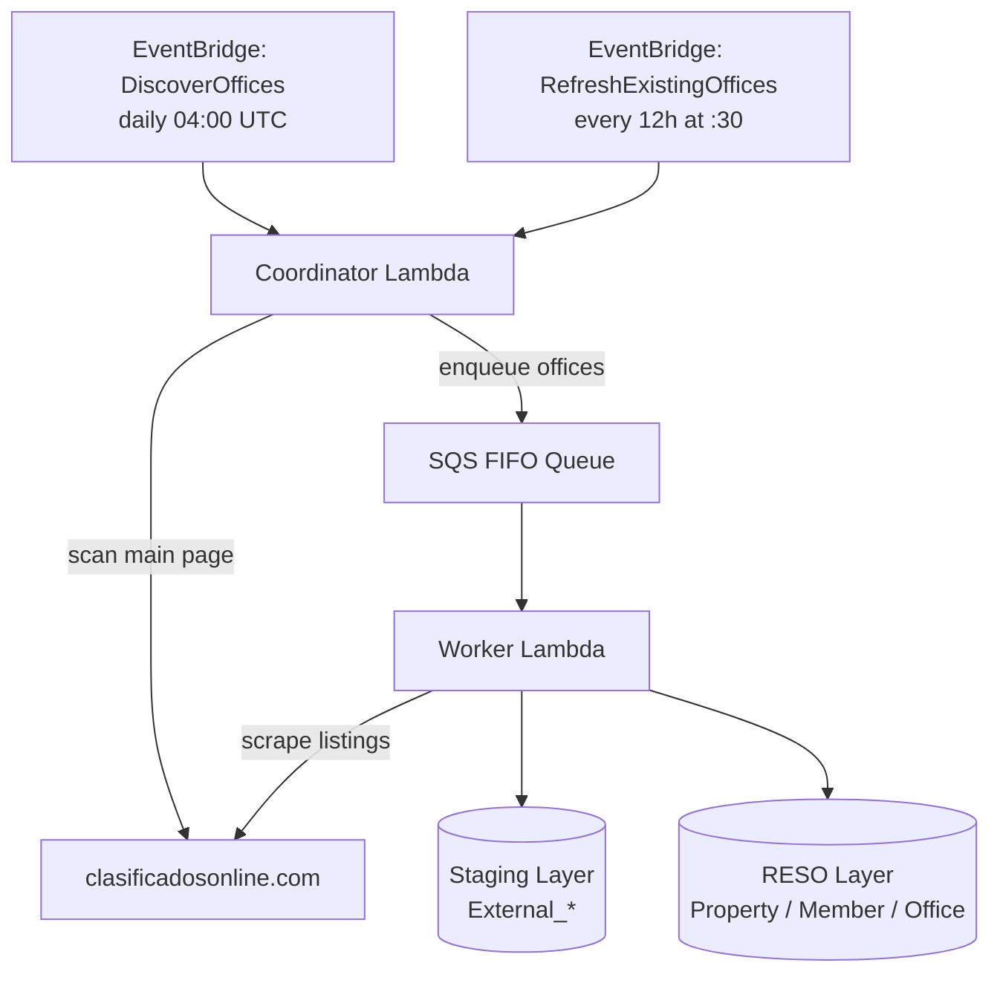
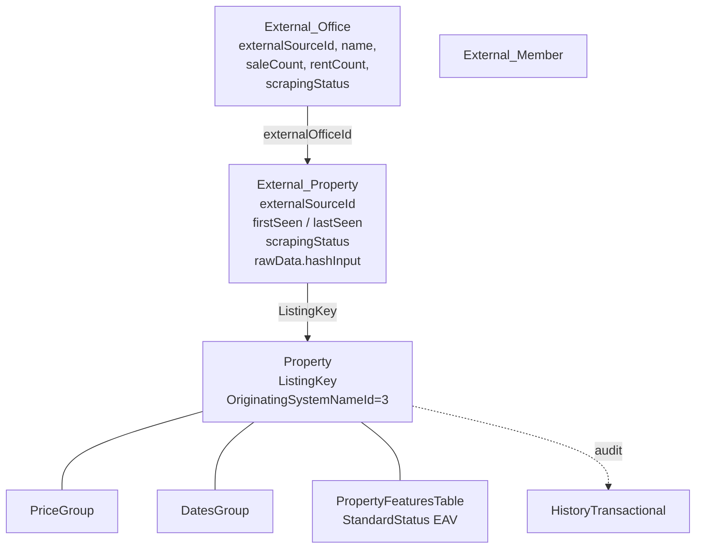

# Data Ingestion: Clasificados Online Pipeline

Clasificados Online (CO) is an automated scraping pipeline that ingests residential property listings from [clasificadosonline.com](https://www.clasificadosonline.com) into the Amplia MLS database. It is identified throughout the RESO schema by `OriginatingSystemNameId = 3` (the full mapping being `1 = Keller Williams`, `2 = AMPLIA` native, `3 = ClasificadosOnline`).

This page documents the architecture and data flow: the Coordinator/Worker Lambda pair, the SQS FIFO dispatch layer, the staging-to-RESO write path, and the audit/change-detection model. For the underlying RESO schema (star-schema property groups, the `PropertyFeaturesTable` EAV pattern, etc.) see [Amplia MySQL](amplia-mysql.md).

Sources: [databases/clasificados-online.md](), [databases/amplia-mysql.md]()

## Architecture Overview

CO runs as an AWS Lambda pair backed by an SQS FIFO queue and driven by two EventBridge schedules:

- **Coordinator** — discovers brokerage offices and dispatches them to SQS.
- **Worker** — consumes one office at a time, scrapes its listings, and writes to both the staging and RESO layers.



Sources: [databases/clasificados-online.md]()

### EventBridge Schedules

| Schedule | Cadence | Behavior |
| --- | --- | --- |
| `DiscoverOffices` | Daily at 04:00 UTC | Walks the CO main page, finds new brokerage offices, refreshes listing counts, enqueues offices with `totalListings > 0`. |
| `RefreshExistingOffices` | Every 12h at :30 | Dispatches every `External_Office` with `scrapingStatus = 'ACTIVE'` without touching the CO main page. |

Freshness bound: listings are refreshed at most every ~12h. Brand-new brokerage offices appear on the daily `DiscoverOffices` run or via manual seeding.

Sources: [databases/clasificados-online.md]()

## Data Layers

CO data lives in two layers:

1. **Staging layer (raw scrape state):** `External_Office`, `External_Member`, `External_Property`. Every row in these tables is CO by definition — no `OriginatingSystemNameId` filter is needed.
2. **RESO layer (clean, queryable):** the standard Amplia tables — `Property`, `Member`, `Office`, `PriceGroup`, `DatesGroup`, `MediaGroup`, `PropertyFeaturesTable`, `HistoryTransactional` — all filtered by `OriginatingSystemNameId = 3`.

The canonical bridge from CO identifiers to RESO keys:

```sql
External_Property.ListingKey = Property.ListingKey
```

`External_Property.externalSourceId` is the human-readable CO listing ID visible in the URL (`detail.asp?ID=12345`).



Sources: [databases/clasificados-online.md](), [databases/amplia-mysql.md]()

### Key Timestamps

| Timestamp | Meaning |
| --- | --- |
| `External_Property.firstSeen` | First time the scraper ingested this listing (= upload) |
| `External_Property.lastSeen` | Most recent scrape run that still found the listing |
| `External_Property.lastScrapedAt` | Alias of `lastSeen`; updated on every successful scrape |
| `External_Office.lastScrapedAt` | Most recent worker run for the office |
| `Property.ModificationTimestamp` | RESO-level last modification |
| `DatesGroup.PriceChangeTimestamp` | Last price change |
| `DatesGroup.WithdrawnDate` / `OffMarketDate` | Set when worker stamps a listing as Withdrawn |
| `HistoryTransactional.ModificationTimestamp` | When a specific field-level audit event was recorded |

All timestamps are stored in UTC. Convert to AST for display with `CONVERT_TZ(ts, '+00:00', '-04:00')` (Puerto Rico is AST, no DST).

Sources: [databases/clasificados-online.md](), [databases/amplia-mysql.md]()

## Worker Processing & Skip Rules

The worker consumes one office message at a time from the SQS FIFO queue, scrapes each listing on that office's page, and decides whether to write it. Some listings are skipped **before any DB write** and only appear in Lambda logs and per-run performance metrics:

| Skip reason | Log format | Metric | Why |
| --- | --- | --- | --- |
| Non-residential type | `SKIPPED \| {Comercial\|Finca\|Solar}` | `skippedNonResidential` | Out of scope for Amplia's residential MLS |
| No parseable agent | `SKIPPED \| no-agent \| <id>` | `skippedNoAgent` | `HistoryTransactional.ChangedByMemberKey` is non-null by schema — no real agent means no auditable ingestion |

Consequence: no `External_Property`, no `Property`, no `PriceGroup`, no `DatesGroup`, no audit row. Counts of CO listings will never include these.

Sources: [databases/clasificados-online.md]()

## Lifecycle States

### Staging status (`External_Property.scrapingStatus`)

- `ACTIVE` — the listing link was seen in the most recent worker run for its office.
- `INACTIVE` — the link disappeared from the office page. The worker stamps the listing Withdrawn on the RESO side when this transition happens.

### RESO Standard Status

`Property.StandardStatusKey` **does not exist**. RESO status is an EAV feature accessed through `PropertyFeaturesTable`:

```
PropertyFeaturesTable (ListingKey, FeatureKey)
  → FeatureKey → Lookup.LookupKey
                  → Lookup.LookupNameId → LookupName.Id (LookupName.LookupName = 'StandardStatus')
```

CO listings are born `Incomplete` (they come from a public HTML directory, not an authoritative MLS feed, so they can't be marked `Active`). The only status transition the worker emits today is:

- `Incomplete → Withdrawn` (when the CO link disappears).

Reactivation (`Withdrawn → Incomplete`) is not implemented. For the general EAV pattern see [Amplia MySQL](amplia-mysql.md).

Sources: [databases/clasificados-online.md](), [databases/amplia-mysql.md]()

## Change Audit Model

The worker uses a content hash over `External_Property.rawData.hashInput` to detect changes. Two outcomes are DB-visible:

### 1. Price change

When `rawData.hashInput.price` differs from the newly-scraped price:

- `PriceGroup.ListPrice` → new price
- `PriceGroup.PreviousListPrice` → old price
- `PriceGroup.ListPriceLow` → only moves downward; initialized to new price on first price change if previously NULL
- `PriceGroup.OriginalListPrice` → immutable; set on first ingestion
- `DatesGroup.PriceChangeTimestamp` / `MajorChangeTimestamp` / `ModificationTimestamp` → `now()`
- `DatesGroup.MajorChangeTypeId` → Id of `MajorChangeType` row where `MajorChangeType = 'Price Change'`
- `HistoryTransactional` row written with:
  - `ResourceId = 3` (Property)
  - `ResourceRecordKey = Property.ListingKey`
  - `ChangeTypeLookupKey` → `Lookup.LookupValue = 'Price Change'`
  - `FieldLookupKey` → `Lookup.LookupValue = 'List Price'`
  - `PreviousValue` / `NewValue` = stringified prices
  - `ChangedByMemberKey` = the real scraped agent

### 2. Withdrawal

When a listing disappears from CO:

- `PropertyFeaturesTable` — the `Incomplete` StandardStatus feature is replaced with `Withdrawn`
- `DatesGroup.WithdrawnDate` / `OffMarketDate` / `OffMarketTimestamp` / `StatusChangeTimestamp` / `MajorChangeTimestamp` / `ModificationTimestamp` → `now()`
- `DatesGroup.MajorChangeTypeId` → `MajorChangeType = 'Withdrawn'`
- `External_Property.scrapingStatus` → `INACTIVE`
- `HistoryTransactional` row with `LookupValue = 'Withdrawn'`, `FieldLookupKey → 'Standard Status'`, `PreviousValue = 'Incomplete'`, `NewValue = 'Withdrawn'`

### What is NOT audited

The worker rewrites beds, baths, photos, description, and property type whenever the content hash changes, but **only price changes and withdrawals** produce a `HistoryTransactional` row. Hash-only jitter (description whitespace, photo count drift) updates `External_Property.rawData` and emits no audit row.

Sources: [databases/clasificados-online.md]()

## Querying CO Data

All queries assume UTC storage with AST display conversion, and the `OriginatingSystemNameId = 3` filter on RESO tables. Because `HistoryTransactional.ChangeTypeLookupKey` and `.FieldLookupKey` are both FKs to `Lookup.LookupKey` (not `MajorChangeType`), filtering by change type goes through `Lookup.LookupValue`.

### Uploads in the last N days

"Uploaded" = first appeared on the scraper (`External_Property.firstSeen`). RESO `Property` rows can pre-exist from a different feed and get linked in later, so `firstSeen` is the correct upload signal.

```sql
SELECT COUNT(*) AS new_co_listings
FROM External_Property ep
JOIN Property p ON p.ListingKey = ep.ListingKey
WHERE p.OriginatingSystemNameId = 3
  AND ep.firstSeen >= NOW() - INTERVAL 7 DAY;
```

### Price changes in the last N days

```sql
SELECT ep.externalSourceId AS co_listing_id,
       ht.ResourceRecordKey AS ListingKey,
       ht.PreviousValue AS old_price,
       ht.NewValue AS new_price,
       ht.ChangedByMemberKey,
       CONVERT_TZ(ht.ModificationTimestamp, '+00:00', '-04:00') AS changed_at_ast
FROM HistoryTransactional ht
JOIN External_Property ep ON ep.ListingKey = ht.ResourceRecordKey
JOIN Property p ON p.ListingKey = ht.ResourceRecordKey
JOIN Lookup change_type ON change_type.LookupKey = ht.ChangeTypeLookupKey
WHERE p.OriginatingSystemNameId = 3
  AND change_type.LookupValue = 'Price Change'
  AND ht.ModificationTimestamp >= NOW() - INTERVAL 7 DAY
ORDER BY ht.ModificationTimestamp DESC;
```

### Rolling 24h summary

```sql
SELECT
  (SELECT COUNT(*) FROM External_Property ep
   JOIN Property p ON p.ListingKey = ep.ListingKey
   WHERE p.OriginatingSystemNameId = 3
     AND ep.firstSeen >= NOW() - INTERVAL 24 HOUR)       AS uploaded_last_24h,
  (SELECT COUNT(*) FROM HistoryTransactional ht
   JOIN Property p ON p.ListingKey = ht.ResourceRecordKey
   JOIN Lookup l ON l.LookupKey = ht.ChangeTypeLookupKey
   WHERE p.OriginatingSystemNameId = 3
     AND l.LookupValue = 'Price Change'
     AND ht.ModificationTimestamp >= NOW() - INTERVAL 24 HOUR) AS price_changes_last_24h,
  (SELECT COUNT(*) FROM HistoryTransactional ht
   JOIN Property p ON p.ListingKey = ht.ResourceRecordKey
   JOIN Lookup l ON l.LookupKey = ht.ChangeTypeLookupKey
   WHERE p.OriginatingSystemNameId = 3
     AND l.LookupValue = 'Withdrawn'
     AND ht.ModificationTimestamp >= NOW() - INTERVAL 24 HOUR) AS withdrawals_last_24h;
```

### Agent/office for a CO listing

```sql
SELECT ep.externalSourceId AS co_listing_id,
       p.ListingKey,
       CONCAT(m.MemberFirstName, ' ', m.MemberLastName) AS agent_name,
       m.MemberStateLicense AS agent_license,
       m.MemberDirectPhone AS agent_phone,
       o.OfficeName AS office_name
FROM External_Property ep
JOIN Property p ON p.ListingKey = ep.ListingKey
LEFT JOIN Member m ON m.MemberKey = p.ListAgentKey
LEFT JOIN Office o ON o.OfficeKey = p.ListOfficeKey
WHERE p.OriginatingSystemNameId = 3
  AND ep.externalSourceId = '22412-123456';
```

For cross-referencing CO listings on external portals, see [Zillow lookup](zillow.md).

Sources: [databases/clasificados-online.md](), [databases/amplia-mysql.md](), [zillow.md]()

## Gotchas and Invariants

- `Property.StandardStatusKey` does **not** exist. RESO status lives in `PropertyFeaturesTable` via the EAV pattern.
- `HistoryTransactional.ChangeTypeLookupKey` and `.FieldLookupKey` are FKs to `Lookup.LookupKey`, **not** to `MajorChangeType`. Filter via `Lookup.LookupValue`.
- `DatesGroup.MajorChangeTypeId` is the only place that joins to `MajorChangeType`.
- Hash-only changes update `External_Property.rawData` but emit **no** `HistoryTransactional` row — not visible in the audit log.
- No-agent listings never reach the DB. They show up only as `SKIPPED | no-agent` log lines and the `skippedNoAgent` metric.
- Every `HistoryTransactional.ChangedByMemberKey` on a CO audit row references a real `Member` row. There is no synthetic system-member fallback.
- Amplia timestamps are UTC; always wrap displayed times in `CONVERT_TZ(ts, '+00:00', '-04:00')` for AST.
- Freshness bound: ~12h refresh cadence; new offices appear on the daily 04:00 UTC discovery run or via manual seeding.

Sources: [databases/clasificados-online.md]()

## Summary

The CO pipeline is a Coordinator → SQS FIFO → Worker Lambda chain that scrapes residential listings from clasificadosonline.com into a two-layer model: CO-specific staging tables (`External_*`) and the standard RESO tables identified by `OriginatingSystemNameId = 3`. The worker uses content-hash change detection to emit exactly two kinds of audited events — price changes and withdrawals — while silently refreshing other fields. Non-residential and no-agent listings are skipped before any DB write and exist only in logs and metrics.