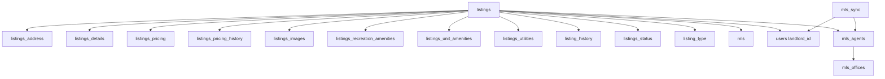
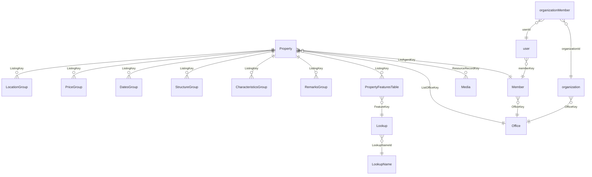

# Databases & Data Model

This page is the reference for the MySQL databases reachable through the Metabase MCP: **Findit** (`find-it-prod`), **Amplia MLS** (`amplia-prod`), and **Amplia MLS Staging** (`amplia-staging`). It covers the core tables, RESO Data Dictionary conventions used by Amplia, cross-MLS join rules for Findit, and the procedure for checking whether an Amplia listing appears on Zillow.

Most analytical questions against these databases involve inventory (for-sale / for-rent properties), users, agents, offices, and saved searches. The two databases model the same domain very differently: Findit uses a classic normalized relational schema with a central `listings` table, while Amplia follows the RESO Data Dictionary — a star-schema around `Property` with EAV-style lookups for enumerated features.

Sources: [databases/general-guidelines.md]()

## Databases at a Glance

| Database | Metabase name | Schema style | Timestamp zone |
|---|---|---|---|
| Findit | `find-it-prod` | Normalized relational, central `listings` table | (not specified) |
| Amplia MLS | `amplia-prod` | RESO Data Dictionary, star schema on `Property` | UTC (convert to AST `-04:00`) |
| Amplia MLS Staging | `amplia-staging` | Same as `amplia-prod` | UTC |

Sources: [databases/general-guidelines.md](), [databases/amplia-mysql.md]()

## Findit (`find-it-prod`)

### Core entity model

The `listings` table is the hub; almost every Findit table joins back to it via `listing_id → listings.id`. Pricing, address, and details live in sibling tables, not on `listings` itself.



Sources: [databases/findit-mysql.md]()

### The `listings` table

| Column | Points to | Meaning |
|---|---|---|
| `mls` | `mls.id` | Source. `NULL` = manual post on Findit. `1` = Xposure, `2` = Stellar, `3` = Amplia. |
| `status` | `listings_status.id` | 1 Vendido, 2 Alquilado, 3 En Alquiler, 4 En Venta, 5 Opcionado, 6 Removido, 7 Archivado. |
| `listing_type` | `listing_type.id` | 1 = Venta, 2 = Alquiler. |
| `listing_home_type` | `listing_home_type.id` | Residential type (Casa, Apartamento, …). |
| `property_type` | `property_type.id` | Broader classification (default 1). |
| `landlord_id` | `users.id` | Set when manually posted; mutually exclusive with `mls_agent_id`. |
| `mls_agent_id` | joins `mls_agents.id` via `mls_agents.mls_agent_id` + matching `mls` | Set when from an MLS feed. |
| `added_on` | — | Creation timestamp. |
| `mls_listing_id` | — | Listing ID in the originating MLS. |
| `numero_catastro` | — | Cadastral number. |
| `3d_tour` / `video_tour` | — | Tour URLs. |

**Key rule:** a listing has *either* `landlord_id` (with `mls IS NULL`) *or* `mls_agent_id` (with `mls IS NOT NULL`), never both.

Sources: [databases/findit-mysql.md]()

### Status logic

- **Sold**: `listing_type = 1` AND `status = 1`
- **Under contract**: `listing_type = 1` AND `status = 5`
- **Rented**: `listing_type = 2` AND `status = 2`
- **Active for sale**: `listing_type = 1` AND `status = 4`
- **Active for rent**: `listing_type = 2` AND `status = 3`

Findit-specific guidelines:
1. Qualify agent/office joins with the `mls` column to avoid cross-MLS ID collisions.
2. `listings.status` is the correct column (not `listing_status`); it maps to `listings_status.id`.
3. Pricing lives in `listings_pricing.price`, not on `listings`.
4. Address lives in `listings_address`, not on `listings`.

Sources: [databases/findit-mysql.md](), [databases/general-guidelines.md]()

### Listing-related tables

| Table | Key columns |
|---|---|
| `listings_address` | `street`, `city`, `zip`, `latitude`, `longitude`, `coordinates` (POINT), `city_id` → `cities.id`, `region_id` |
| `listings_details` | `bathrooms`, `half_bathrooms`, `bedrooms`, `pet_friendly`, `lot_size`, `unit` → `units.id`, `unidad_size`, `unidad_unit` → `units.id`, `construction_year`, `levels`, `flooring`, `cooling`, `parking_spaces`, `parking_type` |
| `listings_pricing` | `price` (DECIMAL 12,2), `pricing_type_id` → `listings_price_type.id` |
| `listings_pricing_history` | `price`, `date` |
| `listings_images` | `image` (URL), `order` |
| `listings_recreation_amenities` | `gym`, `community_pool`, `elevator`, `security_cameras`, `controlled_access`, … |
| `listings_unit_amenities` | `air_conditioning`, `cisterna`, `generator`, `private_pool`, `furnished`, `balcony`, `terrace`, … |
| `listings_utilities` | `water`, `electricity`, `trash`, `gas`, `internet`, `tv`, `mantenimiento` |
| `listing_history` | `action` → `listings_status.id`, `price`, `action_date` |
| `listings_extra_contacts` | `user_id`, `admin`, `assigned_by` |
| `listings_metadata_history` | JSON metadata snapshots with timestamps |
| `sponsored_listings` | `plan_id` → `sponsored_listings_plans.id`, `stripe_id`, date range |

Sources: [databases/findit-mysql.md]()

### Agents, offices, and cross-MLS joins

- `mls_agents`: PK `id`; unique on **(`mls`, `mls_agent_id`)**. Has `mls_office_id`, `email`, `first_name`, `last_name`, `phone`, `license`, `slug`.
- `mls_offices`: PK `id`; unique on **(`mls`, `mls_office_id`)**. Has `name`, `address`, `office_email`, `phone`, `website`.
- `mls_sync`: links a Findit `users.id` to an `mls_agents.id` when an MLS agent also has a Findit account. Unique on (`mls_id`, `mls_user_id`, `user_id`).

Because `mls_agent_id`/`mls_office_id` are only unique *per MLS*, **always filter/join on both the ID column AND the `mls` column**.

Sources: [databases/findit-mysql.md](), [databases/general-guidelines.md]()

### Users

| Column | Meaning |
|---|---|
| `first_name`, `last_name`, `name` | `name` is a computed/concat field |
| `email` | Unique |
| `phone` | Unique, nullable |
| `agente` | Boolean — self-identified as agent |
| `user_type_id` → `users_type.id` | 1 AGENT, 2 PROFESSIONAL, 3 BUYER, 4 FSBO, NULL = not yet selected |
| `created_at` | Registration date |
| `confirmed_email`, `banned` | Booleans |

Sources: [databases/findit-mysql.md]()

### Saved searches

Use `saved_searches`: `user_id`, `name`, `url`, `query` (JSON — the Elasticsearch percolator query), `timestamp`, `removed_timestamp`, `sold` (whether it tracks sold properties). **Ignore `users_saved_searches` — it is deprecated.**

Sources: [databases/findit-mysql.md]()

### Geography

- `cities`: `id`, `name`, `city_shape` (polygon), `geojson`, `bounds`.
- `barrios`: `id`, `barrio`, `city_id`.
- `sectores`: `id`, `sector`, `barrio_id`, `city_id`.
- `zips`: `id` (the zip code itself), `city_id`.
- `regions`: `id`, `name`.
- `parcel`: `catastro`, `parcela`, `parcela_procedencia`, `city_id`, `polygon`.

Sources: [databases/findit-mysql.md]()

### Other notable tables

- `contact_via_findit` — lead capture on a listing.
- `service_providers` — directory businesses; `user_id → users.id`, `category_id → ads_categories.id`.
- `directory_ads` — Stripe-backed ads for service providers.

Sources: [databases/findit-mysql.md]()

## Amplia MLS (`amplia-prod` & `amplia-staging`)

Amplia is built on the [RESO Data Dictionary](https://ddwiki.reso.org/display/DDW20). The three core RESO tables are `Property`, `Member`, and `Office`. Property attributes are spread across a family of "group" tables joined by `ListingKey`, and enumerated values come from an EAV lookup chain (`PropertyFeaturesTable` → `Lookup` → `LookupName`).

Sources: [databases/amplia-mysql.md]()

### Entity-relationship overview



Sources: [databases/amplia-mysql.md]()

### `Property`

Composite PK `(ListingId, ListingKey)`, but **`ListingKey` is the main FK everywhere**.

| Column | Meaning |
|---|---|
| `ListingId` | Human-readable listing ID (unique) |
| `ListingKey` | System-generated UUID-style key (unique, used as FK) |
| `ListAgentKey` → `Member.MemberKey` | Listing agent |
| `ListOfficeKey` → `Office.OfficeKey` | Office |
| `OriginatingSystemNameId` → `AMPLIA_OriginatingSystem.Id` | Source system. `NULL` = native Amplia; non-null = external feed (e.g. Keller Williams). |

Sources: [databases/amplia-mysql.md]()

### Property data groups (star schema on `ListingKey`)

| Group table | Key columns |
|---|---|
| `LocationGroup` | `CityId` → `Cities.Id`, `PostalCodeId` → `PostalCode.Id`, `StreetName`, `StreetNumber`, `StreetSuffix`, `UnitNumber`, `Coordinates` (POINT) |
| `PriceGroup` | `ListPrice`, `ClosePrice`, `OriginalListPrice`, `PreviousListPrice`, `ListPriceLow` |
| `DatesGroup` | `ModificationTimestamp` (UTC), `OriginalEntryTimestamp`, `ActivationDate`, `ExpirationDate`, `CloseDate`, `ListingContractDate`, `OnMarketDate`, `OffMarketDate`, `StatusChangeTimestamp`, `DaysOnMarket`, `CumulativeDaysOnMarket`, `PriceChangeTimestamp`, `PendingTimestamp`, `WithdrawnDate`, `CancellationDate`, `BackOnMarketDate` |
| `StructureGroup` | `BedroomsTotal`, `BedroomsPossible`, `BathroomsFull`, `BathroomsHalf`, `BathroomsTotalInteger`, `LivingArea`, `BuildingAreaTotal`, `LeasableArea`, `Stories`, `StoriesTotal`, `YearBuilt`, `ParkingTotal`, `GarageSpaces`, `OpenParkingSpaces`, `NewConstructionYN`, `BuildingName` |
| `CharacteristicsGroup` | `LotSizeArea`, `LotSizeAcres`, `LotSizeSquareFeet`, `LotSizeDimensions`, `NumberOfUnitsTotal`, `NumberOfBuildings`, `PoolPrivateYN`, `WaterfrontYN`, `ViewYN`, `SeniorCommunityYN` |
| `TaxGroup` | `ParcelNumber`, `TaxAnnualAmount`, `Zoning` |
| `FinancialGroup` | `CapRate`, `GrossIncome`, `NetOperatingIncome`, `TotalActualRent`, `NumberOfUnitsLeased`, `NumberOfUnitsVacant`, various expenses |
| `HOAGroup` | `AssociationFee`, `AssociationName`, `AssociationPhone`, `AssociationYN` |
| `CompensationGroup` | `BuyerBrokerageCompensation`, `CompensationComments` |
| `ClosingGroup` | `AvailabilityDate` |
| `FarmingGroup` | `CropsIncludedYN`, `CultivatedArea` |
| `MarketingGroup` | `VirtualTourURLBranded`, `VirtualTourURLUnbranded` |
| `MediaGroup` | `PhotosChangeTimestamp`, `VideosChangeTimestamp` |
| `RemarksGroup` | `PublicRemarks`, `PrivateRemarks`, `PrivateOfficeRemarks`, `SyndicationRemarks` |
| `UtilitiesGroup` | `ElectricOnPropertyYN`, `NumberOfSeparateElectricMeters`, etc. |
| `ContractGroup` | `Exclusions`, `Inclusions` |

**Prefer `LEFT JOIN` for all group tables** — not every listing has data in every group.

Sources: [databases/amplia-mysql.md](), [databases/general-guidelines.md]()

### Totals and time zones

Total bathrooms formula (note that `StructureGroup.BathroomsTotalInteger` is stored but may not always be populated):

```sql
CAST(
  CASE
    WHEN sg.BathroomsFull IS NULL AND sg.BathroomsHalf IS NULL THEN NULL
    WHEN sg.BathroomsFull IS NULL THEN sg.BathroomsHalf
    WHEN sg.BathroomsHalf IS NULL THEN sg.BathroomsFull
    ELSE sg.BathroomsFull + sg.BathroomsHalf
  END AS UNSIGNED
) AS BathroomsTotalInteger
```

Amplia timestamps are UTC. Convert to AST (Puerto Rico, no DST) for display:

```sql
CONVERT_TZ(dg.ModificationTimestamp, '+00:00', '-04:00')
```

Sources: [databases/amplia-mysql.md](), [databases/general-guidelines.md]()

### Property Features — the lookup pattern

Features like `StandardStatus`, `PropertyType`, `PropertySubType`, `LivingAreaUnits`, `SyndicateTo`, and `LotSizeUnits` use a generic EAV chain:

```
PropertyFeaturesTable (ListingKey, FeatureKey)  -- composite PK
  → FeatureKey → Lookup.LookupKey
                  → Lookup.LookupNameId → LookupName.Id
```

- `LookupName.LookupName` identifies *what* the feature is (`'StandardStatus'`, `'PropertyType'`, …).
- `Lookup.LookupValue` = English value (use for `WHERE`).
- `Lookup.AMPLIA_ES_LookupValue` = Spanish display value.
- `Lookup.StandardLookupValue` = RESO standard value.

Recommended subquery pattern (one per feature type; `GROUP BY ListingKey` handles multi-value features):

```sql
LEFT JOIN (
  SELECT pft.ListingKey,
         l.AMPLIA_ES_LookupValue AS LookupValue,
         l.LookupValue AS LookupValue_EN
  FROM PropertyFeaturesTable pft
  JOIN Lookup l ON l.LookupKey = pft.FeatureKey
  JOIN LookupName ln ON ln.Id = l.LookupNameId
  WHERE ln.LookupName = '<FeatureName>'
  GROUP BY pft.ListingKey
) alias ON alias.ListingKey = p.ListingKey
```

Don't try to join `PropertyFeaturesTable` directly without a `LookupName` filter.

Sources: [databases/amplia-mysql.md](), [databases/general-guidelines.md]()

### StandardStatus values

| Status | Meaning |
|---|---|
| `Active` | On market |
| `Active Under Contract` | Under contract but still showing |
| `Coming Soon` | Pre-market |
| `Closed` | Sold/completed |
| `Incomplete` | Draft / not yet published |
| `Withdrawn` / `Canceled` / `Expired` | Off market |

- **Active inventory** = `LookupValue_EN IN ('Active', 'Active Under Contract', 'Coming Soon')`
- **Draft inventory** = `LookupValue_EN IN ('Incomplete')`

Sources: [databases/amplia-mysql.md]()

### Sale vs. rent detection

Check the Spanish `PropertyType` value — if it contains "Alquiler", it's a rental:

```sql
IF(pt.LookupValue LIKE '%Alquiler%', 'false', 'true') AS for_sale
```

Sources: [databases/amplia-mysql.md]()

### SyndicateTo values

A property can carry multiple `SyndicateTo` values (multi-value feature) — use `GROUP_CONCAT` or a membership subquery.

| Value | Meaning |
|---|---|
| `finditpr.com` | Syndicated to finditpr.com |
| `Zillow/Trulia` | Syndicated to Zillow and Trulia |
| `Realtor.com` | Syndicated to Realtor.com |
| `ListHub` | Syndicated to ListHub.com |
| `Homes.com` | Syndicated to Homes.com |
| `Brevitas` | Syndicated to Brevitas |
| `Crexi` | Syndicated to Crexi |
| `IDX` | Syndicated to IDX feed clients |

- **Syndicated to Findit** = `LookupValue_EN = 'finditpr.com'`
- **Syndicated to any portal** = `LookupValue_EN IN ('finditpr.com', 'Zillow/Trulia', 'Realtor.com', 'ListHub', 'Homes.com', 'Brevitas', 'Crexi', 'IDX')`

Sources: [databases/amplia-mysql.md]()

### `Member` (Agents)

| Column | Meaning |
|---|---|
| `MemberKey` | Primary key (UUID-style) |
| `MemberKeyNumeric` | Auto-increment numeric ID |
| `MemberMlsId` | MLS ID string |
| `MemberFirstName`, `MemberLastName`, `MemberMiddleName`, `MemberNickname` | Name fields |
| `MemberEmail`, `MemberDirectPhone` | Contact |
| `MemberStateLicense`, `MemberStateLicenseExpirationDate` | License |
| `MemberStatusLookupKey` → `Lookup.LookupKey` | Active/Inactive |
| `MemberTypeLookupKey` → `Lookup.LookupKey` | Agent, Broker, … |
| `OfficeKey` → `Office.OfficeKey` | Owning office |
| `OriginatingSystemMemberKey`, `OriginatingSystemNameId` | Externally-synced members (e.g. KW) |

Sources: [databases/amplia-mysql.md]()

### `Office`

| Column | Meaning |
|---|---|
| `OfficeKey` | Primary key (UUID-style) |
| `OfficeKeyNumeric` | Auto-increment numeric ID |
| `OfficeMlsId` | MLS ID string |
| `OfficeName` | Name |
| `OfficeEmail`, `OfficePhone` | Contact |
| `OfficeCorporateLicense` | Corporate license |
| `OfficeBrokerKey` → `Member.MemberKey` | Broker/principal |
| `MainOfficeKey` → `Office.OfficeKey` | Parent office (self-referential, for branches) |
| `OfficeStatusLookupKey` → `Lookup` | Active/Inactive |
| `OfficeBranchTypeLookupKey` → `Lookup` | Branch type |
| `OriginatingSystemOfficeKey`, `OriginatingSystemNameId` | Externally-synced offices |

Sources: [databases/amplia-mysql.md]()

### Users & Organizations

- `user`: Platform users. `user.memberKey → Member.MemberKey` ties a user to their RESO Member record. Has `sandBox` (test users), `onboardCompleted`, `stripeCustomerId`.
- `organization`: `organization.OfficeKey → Office.OfficeKey`. Has `name`, `slug`, `logo`.
- `organizationMember`: joins `userId → user.id` and `organizationId → organization.id` with a `role`.
- `invitation`: org invites with `email`, `role`, `status`, `expiresAt`.

This structure lets partner systems (e.g. Keller Williams) ingest Members and Offices without requiring the individual to sign up directly.

Sources: [databases/amplia-mysql.md]()

### Other Amplia tables

- `rentspree`: `ListingKey → Property.ListingKey`. Holds `shortenLink` / `fullL