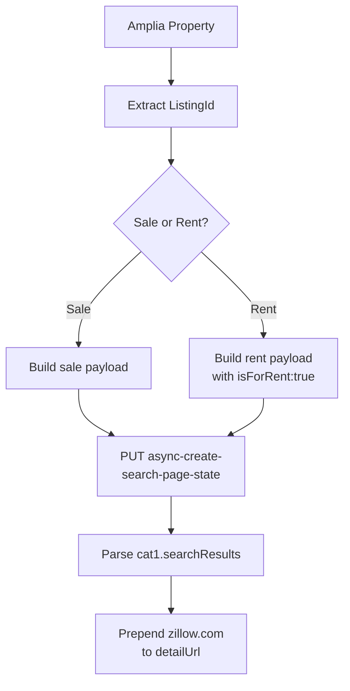
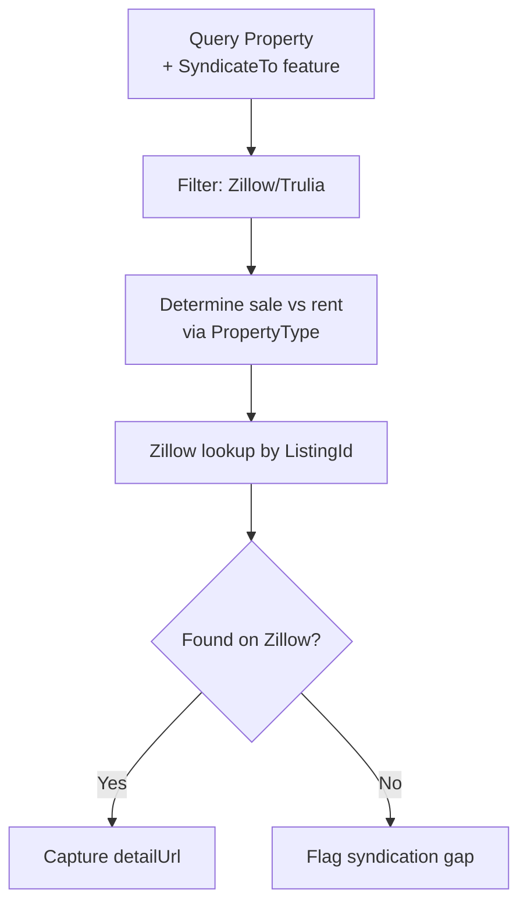

# External Data Lookups (Zillow)

This page documents how to cross-reference Amplia MLS listings against Zillow to determine whether a given listing is being shown on Zillow (either for sale or for rent). The lookup uses Zillow's internal `async-create-search-page-state` endpoint, passing the Amplia `ListingId` as a keyword filter scoped to Puerto Rico.

This is typically used alongside the Amplia `SyndicateTo` feature (see [Amplia MySQL](databases/amplia-mysql.md)) — the MLS records which portals a listing is *supposed* to be syndicated to (including `Zillow/Trulia`), while this lookup verifies what Zillow is *actually* displaying.

Sources: [zillow.md](), [databases/amplia-mysql.md]()

## Overview

Zillow exposes an internal `PUT` endpoint, `https://www.zillow.com/async-create-search-page-state`, that backs its map-search UI. By submitting a search scoped to Puerto Rico with an MLS listing ID in the `keywords` filter, you can check whether Zillow has a matching listing indexed. No webscraper is required — it's a single authenticated HTTP request.

Sources: [zillow.md]()

## Request Flow



Whether the listing is for sale or for rent in Amplia can be inferred from the Spanish `PropertyType` lookup value (`%Alquiler%` indicates rental). That determines which Zillow payload variant to send.

Sources: [zillow.md](), [databases/amplia-mysql.md]()

## Endpoint Details

| Field | Value |
|---|---|
| URL | `https://www.zillow.com/async-create-search-page-state` |
| Method | `PUT` |
| Content-Type | `application/json` |
| User-Agent | Standard desktop browser UA required |
| Cookies | Required — real browser session cookies |

**Cookies are required.** A request without valid Zillow session cookies will return empty responses. Minimal cookies may not work; the recommendation is to use the full cookie jar captured from a browser inspection session.

Sources: [zillow.md]()

## Search Query Parameters

The request body wraps a `searchQueryState` object. Important fields:

| Path | Purpose |
|---|---|
| `regionSelection[0].regionId` | `48` — Puerto Rico |
| `regionSelection[0].regionType` | `2` |
| `mapBounds` | Lat/lng box covering Puerto Rico |
| `filterState.keywords.value` | The Amplia `ListingId` to search for |
| `filterState.sortSelection.value` | `"days"` |
| `filterState.isForRent.value` | `true` — only in the rent variant |
| `usersSearchTerm` | `"PR"` |
| `wants.cat1` | `["listResults", "mapResults"]` |

Sources: [zillow.md]()

## For Sale Lookup

```bash
curl -s 'https://www.zillow.com/async-create-search-page-state' \
  -X 'PUT' \
  -H 'content-type: application/json' \
  -H 'user-agent: Mozilla/5.0 (Macintosh; Intel Mac OS X 10_15_7) AppleWebKit/537.36 (KHTML, like Gecko) Chrome/147.0.0.0 Safari/537.36' \
  --data-raw '{"searchQueryState":{"pagination":{},"isMapVisible":true,"mapBounds":{"west":-68.13407255664063,"east":-65.03318144335938,"south":16.605413165154555,"north":19.780415530144108},"regionSelection":[{"regionId":48,"regionType":2}],"filterState":{"sortSelection":{"value":"days"},"isActiveStatus":{"value":false},"isComingSoonStatus":{"value":false},"isZillowPreview":{"value":false},"keywords":{"value":"LISTING_ID_HERE"}},"isListVisible":true,"mapZoom":9,"usersSearchTerm":"PR"},"wants":{"cat1":["listResults","mapResults"],"cat2":["total"],"abTrials":["total"]},"requestId":8,"isDebugRequest":false}'
```

Sources: [zillow.md]()

## For Rent Lookup

The rent variant adds explicit rental/sale flags to `filterState` — notably `isForRent: true` plus setting all sale-type flags to `false`:

```bash
curl -s 'https://www.zillow.com/async-create-search-page-state' \
  -X 'PUT' \
  -H 'content-type: application/json' \
  -H 'user-agent: Mozilla/5.0 (Macintosh; Intel Mac OS X 10_15_7) AppleWebKit/537.36 (KHTML, like Gecko) Chrome/147.0.0.0 Safari/537.36' \
  --data-raw '{"searchQueryState":{"pagination":{},"isMapVisible":true,"mapBounds":{"west":-67.1450235891493,"east":-65.6673624563368,"south":16.605413165154555,"north":19.780415530144108},"regionSelection":[{"regionId":48,"regionType":2}],"filterState":{"sortSelection":{"value":"days"},"isActiveStatus":{"value":false},"isComingSoonStatus":{"value":false},"isZillowPreview":{"value":false},"keywords":{"value":"LISTING_ID_HERE"},"isForRent":{"value":true},"isForSaleByAgent":{"value":false},"isForSaleByOwner":{"value":false},"isNewConstruction":{"value":false},"isComingSoon":{"value":false},"isAuction":{"value":false},"isForSaleForeclosure":{"value":false}},"isListVisible":true,"mapZoom":9,"usersSearchTerm":"PR"},"wants":{"cat1":["listResults","mapResults"]},"requestId":15,"isDebugRequest":false}'
```

Note the rent variant also uses slightly tighter `mapBounds` and omits `cat2`/`abTrials` from `wants`.

Sources: [zillow.md]()

## Response Shape

Listings are returned in:

- `cat1.searchResults.listResults`
- `cat1.searchResults.mapResults`

Each result contains a nested `hdpData.homeInfo.detailUrl`. To get the full Zillow URL for the listing, prepend `https://www.zillow.com` to that path.

If the keyword search returns no matching results, the listing is not on Zillow (or the cookies are invalid — verify the session first).

Sources: [zillow.md]()

## Tying Back to Amplia

When building a reconciliation job, the typical flow is to pull candidate listings from Amplia and then query Zillow per listing:



Relevant Amplia joins (see [Amplia MySQL](databases/amplia-mysql.md)):

- `Property.ListingId` — the human-readable ID that goes into `keywords.value`.
- `PropertyFeaturesTable` + `Lookup` with `LookupName = 'SyndicateTo'` and `LookupValue_EN = 'Zillow/Trulia'` identifies which listings are intended to appear on Zillow.
- `PropertyType` lookup — a value containing `Alquiler` indicates a rental, which selects the for-rent payload variant.

Sources: [zillow.md](), [databases/amplia-mysql.md]()

## Operational Notes

- **Single request, no scraping.** This is not HTML scraping — it's a JSON API call that backs Zillow's own frontend.
- **Session cookies are the bottleneck.** Plan for cookie refresh when they expire; empty responses usually indicate an auth problem rather than a truly missing listing.
- **Puerto Rico scope.** `regionId: 48` / `regionType: 2` plus the PR-wide `mapBounds` constrain results — don't change these when looking up PR listings.

Sources: [zillow.md]()