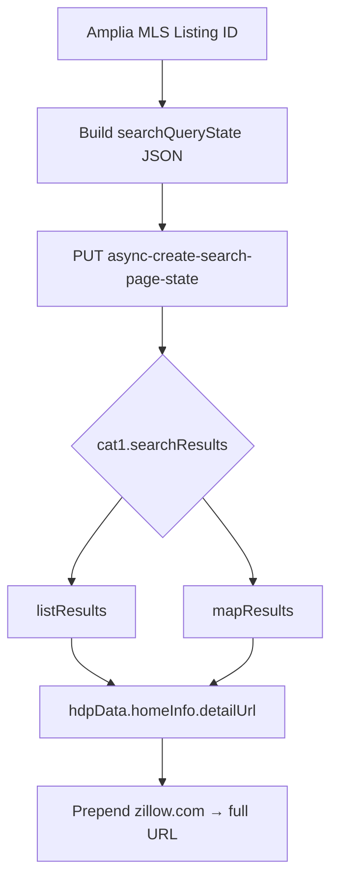

# External Integrations & Lookups

This page documents techniques for cross-referencing Amplia MLS data with external real-estate platforms. The primary use case covered here is determining whether a given Amplia MLS listing is also syndicated to Zillow, by querying Zillow's internal search API with the MLS listing ID.

Because Amplia listings are scoped to Puerto Rico, the lookups below are parameterized for the Puerto Rico region on Zillow (`regionId: 48`, `regionType: 2`).

Sources: [zillow.md](), [wiki-test/external-integrations-lookups.md]()

## Zillow Listing Lookup

Zillow exposes an `async-create-search-page-state` endpoint that powers its search results page. By sending a `PUT` request with the MLS listing ID placed in the `filterState.keywords.value` field, you can check whether a specific Amplia listing is present on Zillow. This is a simple `curl` request — no webscraper is needed.

Sources: [zillow.md]()

### Request Flow



Sources: [zillow.md](), [wiki-test/external-integrations-lookups.md]()

### Endpoint and Method

| Field | Value |
|---|---|
| URL | `https://www.zillow.com/async-create-search-page-state` |
| Method | `PUT` |
| Content-Type | `application/json` |
| Region (Puerto Rico) | `regionId: 48`, `regionType: 2` |
| Listing ID location | `filterState.keywords.value` |

Sources: [zillow.md]()

## For-Sale Listings

For-sale lookups use a minimal `filterState` containing only `sortSelection`, the active/coming-soon/preview flags, and `keywords`. The `mapBounds` span all of Puerto Rico (west `-68.134…`, east `-65.033…`, south `16.605…`, north `19.780…`), and `wants` requests `cat1` (`listResults`, `mapResults`) plus `cat2`/`abTrials` totals.

```bash
curl -s 'https://www.zillow.com/async-create-search-page-state' \
  -X 'PUT' \
  -H 'content-type: application/json' \
  -H 'user-agent: Mozilla/5.0 (Macintosh; Intel Mac OS X 10_15_7) AppleWebKit/537.36 (KHTML, like Gecko) Chrome/147.0.0.0 Safari/537.36' \
  --data-raw '{"searchQueryState":{"pagination":{},"isMapVisible":true,"mapBounds":{"west":-68.13407255664063,"east":-65.03318144335938,"south":16.605413165154555,"north":19.780415530144108},"regionSelection":[{"regionId":48,"regionType":2}],"filterState":{"sortSelection":{"value":"days"},"isActiveStatus":{"value":false},"isComingSoonStatus":{"value":false},"isZillowPreview":{"value":false},"keywords":{"value":"LISTING_ID_HERE"}},"isListVisible":true,"mapZoom":9,"usersSearchTerm":"PR"},"wants":{"cat1":["listResults","mapResults"],"cat2":["total"],"abTrials":["total"]},"requestId":8,"isDebugRequest":false}'
```

Sources: [zillow.md]()

## For-Rent Listings

Rental lookups use the same endpoint but add a set of rental-specific flags to `filterState`. The critical flag is `isForRent: true`; the other booleans explicitly disable competing sale categories so only rental inventory is returned.

| filterState flag | Value |
|---|---|
| `isForRent` | `true` |
| `isForSaleByAgent` | `false` |
| `isForSaleByOwner` | `false` |
| `isNewConstruction` | `false` |
| `isComingSoon` | `false` |
| `isAuction` | `false` |
| `isForSaleForeclosure` | `false` |

The rental variant also narrows `mapBounds` (west `-67.1450…`, east `-65.6673…`) and drops `cat2`/`abTrials` from `wants`.

```bash
curl -s 'https://www.zillow.com/async-create-search-page-state' \
  -X 'PUT' \
  -H 'content-type: application/json' \
  -H 'user-agent: Mozilla/5.0 (Macintosh; Intel Mac OS X 10_15_7) AppleWebKit/537.36 (KHTML, like Gecko) Chrome/147.0.0.0 Safari/537.36' \
  --data-raw '{"searchQueryState":{"pagination":{},"isMapVisible":true,"mapBounds":{"west":-67.1450235891493,"east":-65.6673624563368,"south":16.605413165154555,"north":19.780415530144108},"regionSelection":[{"regionId":48,"regionType":2}],"filterState":{"sortSelection":{"value":"days"},"isActiveStatus":{"value":false},"isComingSoonStatus":{"value":false},"isZillowPreview":{"value":false},"keywords":{"value":"LISTING_ID_HERE"},"isForRent":{"value":true},"isForSaleByAgent":{"value":false},"isForSaleByOwner":{"value":false},"isNewConstruction":{"value":false},"isComingSoon":{"value":false},"isAuction":{"value":false},"isForSaleForeclosure":{"value":false}},"isListVisible":true,"mapZoom":9,"usersSearchTerm":"PR"},"wants":{"cat1":["listResults","mapResults"]},"requestId":15,"isDebugRequest":false}'
```

Sources: [zillow.md]()

## Parsing the Response

Matching listings are returned under:

- `cat1.searchResults.listResults`
- `cat1.searchResults.mapResults`

Each result includes `hdpData.homeInfo.detailUrl`, which is a path. Prepend `https://www.zillow.com` to construct the full listing URL.

Sources: [zillow.md](), [wiki-test/external-integrations-lookups.md]()

## Session Cookies Requirement

Cookies are required for this endpoint. Without valid Zillow session cookies (captured from a real browser session), the API tends to return empty responses. Minimal or hand-crafted cookie sets may not be sufficient — the recommended approach is to copy the full cookie jar from a browser inspection and attach it to the request.

Sources: [zillow.md]()

## Summary

The Zillow `async-create-search-page-state` endpoint provides a lightweight, scraper-free way to look up Amplia MLS listings on Zillow. The same endpoint serves both for-sale and for-rent queries; the differences are confined to `filterState` flags and map bounds. The only meaningful operational hurdle is supplying real browser-session cookies.

Sources: [zillow.md](), [wiki-test/external-integrations-lookups.md]()