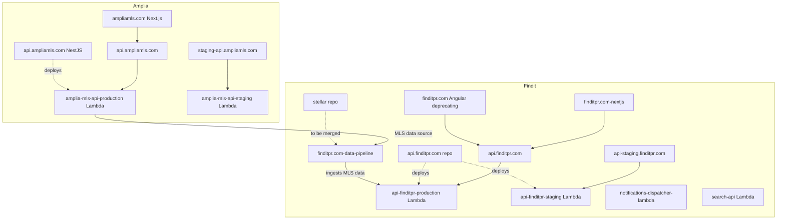
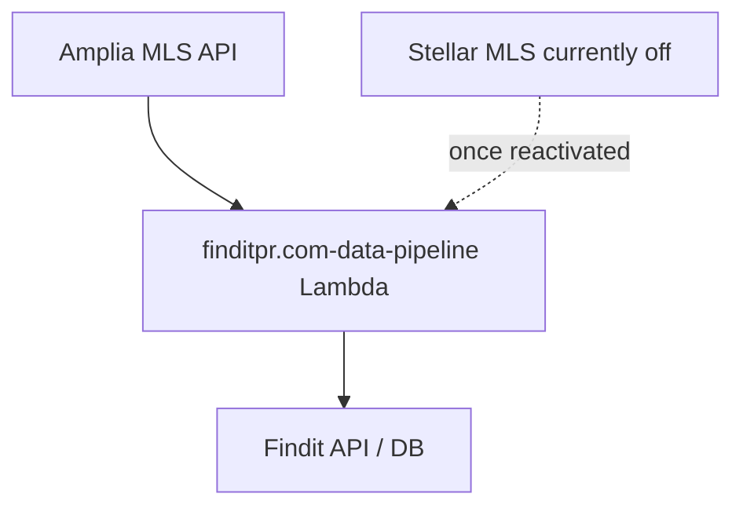

# Infrastructure & Repositories

This page documents the AWS Lambda infrastructure and GitHub repositories that power Findit (`finditpr.com`) and Amplia MLS (`ampliamls.com`). Both products share the same AWS account and region, and each has a backend API running as a Lambda behind a public API domain, paired with a Next.js frontend and — in Findit's case — a small set of supporting Lambdas.

For broader product context (Metabase databases, GA properties, AWS CLI profiles), see the team overview in `general-knowledge.md`. Sources: [general-knowledge.md]()

## System Architecture

The diagram below shows how public API domains map to Lambda functions, and how those Lambdas relate to their source repositories and frontends.

Sources: [infra/findit-and-amplia-aws.md](), [repos/findit-repos.md](), [repos/amplia-repos.md]()

## AWS Lambda Environments

All API Lambdas for both Findit and Amplia MLS run in the `us-east-1` region under AWS account `722295155959`. Findit and Amplia share the same AWS infrastructure, accessed with the `--profile=finditpr.com` AWS CLI profile.

| Domain | Environment | Lambda ARN |
| --- | --- | --- |
| `api.finditpr.com` | FindIt production | `arn:aws:lambda:us-east-1:722295155959:function:api-finditpr-production` |
| `api-staging.finditpr.com` | FindIt staging | `arn:aws:lambda:us-east-1:722295155959:function:api-finditpr-staging` |
| `api.ampliamls.com` | Amplia MLS production | `arn:aws:lambda:us-east-1:722295155959:function:amplia-mls-api-production` |
| `staging-api.ampliamls.com` | Amplia MLS staging | `arn:aws:lambda:us-east-1:722295155959:function:amplia-mls-api-staging` |

These ARNs are useful when debugging infrastructure issues (logs, configuration, invocations). Sources: [infra/findit-and-amplia-aws.md](), [general-knowledge.md]()

## Findit Repositories

Findit is split across a backend API, two frontends (one being deprecated), and several supporting Lambdas.

### Core application

| Component | Repository | Notes |
| --- | --- | --- |
| API backend | `github.com/jginorio/api.finditpr.com` | Deploys to `api-finditpr-production` / `api-finditpr-staging` Lambdas |
| Web frontend (Angular) | `github.com/jginorio/finditpr.com` | Being deprecated in favor of the Next.js version |
| Web frontend (Next.js) | `github.com/jginorio/finditpr.com-nextjs` | Replacement for the Angular frontend |

### Lambdas and services

- **Notifications dispatcher (Lambda)** — `github.com/jginorio/notifications-dispatcher-lambda`
- **Search API (Lambda)** — `github.com/jginorio/search-api`. Handles autocomplete suggestions on Findit.
- **Data pipeline (Lambda)** — `github.com/jginorio/finditpr.com-data-pipeline`. Responsible for getting Amplia MLS data into `finditpr.com`.
- **Stellar (standalone repo)** — `github.com/jginorio/stellar`. The Stellar integration is currently shut down inside the data pipeline repo. Once it is turned back on, the standalone `stellar` repo can be gracefully deprecated and everything consolidated under `finditpr.com-data-pipeline`, since Stellar MLS data is ingested basically the same way as Amplia MLS data.

Sources: [repos/findit-repos.md]()

## Amplia MLS Repositories

Amplia MLS has a simpler two-repo layout: a NestJS backend deployed to Lambda, and a Next.js frontend.

| Component | Repository | Stack |
| --- | --- | --- |
| Backend | `github.com/jginorio/api.ampliamls.com` | NestJS Lambda backend |
| Frontend | `github.com/jginorio/ampliamls.com` | Next.js frontend |

The backend deploys to the `amplia-mls-api-production` and `amplia-mls-api-staging` Lambdas listed above. Sources: [repos/amplia-repos.md](), [infra/findit-and-amplia-aws.md]()

## Cross-Product Data Flow

Amplia MLS is not only a standalone product — it is also a data source for Findit. The `finditpr.com-data-pipeline` Lambda ingests Amplia MLS data into Findit, and is being positioned to also absorb the Stellar MLS ingestion once that integration is reactivated.

Sources: [repos/findit-repos.md]()

## Summary

Findit and Amplia MLS share a single AWS account and region, with each API domain (production and staging) mapped to a dedicated Lambda function. Repositories are organized per-product: Amplia keeps a clean backend/frontend split, while Findit has a richer ecosystem including a deprecating Angular frontend, its Next.js replacement, and supporting Lambdas for notifications, search autocomplete, and MLS data ingestion. Sources: [infra/findit-and-amplia-aws.md](), [repos/findit-repos.md](), [repos/amplia-repos.md](), [general-knowledge.md]()