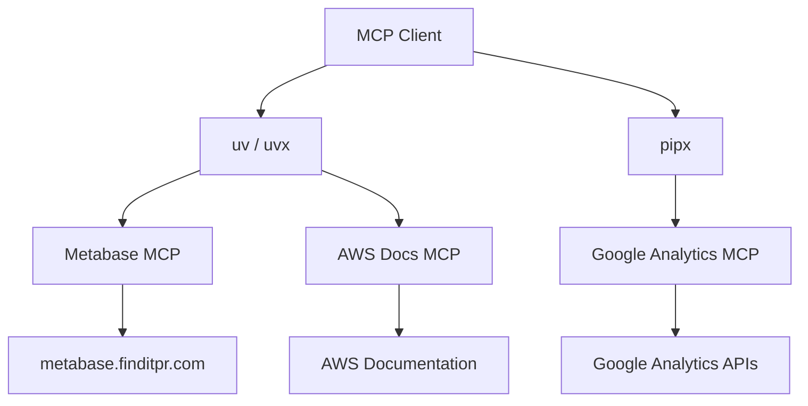
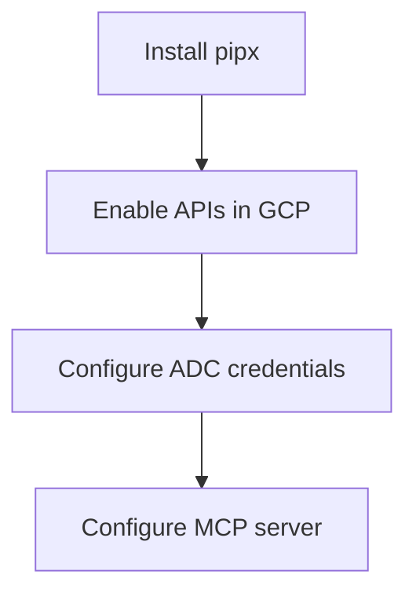

# MCP Servers & Tooling Setup

This page documents the Model Context Protocol (MCP) servers the team uses to expose internal systems and third-party data sources to AI agents. Configuring these servers lets an MCP-compatible client (e.g. Claude Desktop, Cursor) query Metabase dashboards, AWS documentation, and Google Analytics properties directly during a chat session.

The three MCP servers covered here — Metabase, AWS Docs, and Google Analytics — all run locally via a Python process manager. Metabase and AWS Docs are launched with `uvx`, while Google Analytics is launched with `pipx run`. Before configuring any `uvx`-based server, make sure `uv` is installed on your machine.

Sources: [mcp/metabase-mcp.md](), [mcp/aws-docs-mcp.md](), [mcp/google-analytics-mcp.md](), [mcp/uvx.md]()

## Overview



| MCP Server | Launcher | Primary credential |
|---|---|---|
| Metabase | `uvx` | `METABASE_API_KEY` |
| AWS Docs | `uvx` | None |
| Google Analytics | `pipx` | `GOOGLE_APPLICATION_CREDENTIALS` (ADC JSON) |

Sources: [mcp/metabase-mcp.md](), [mcp/aws-docs-mcp.md](), [mcp/google-analytics-mcp.md](), [mcp/uvx.md]()

## Prerequisite: Installing `uv` on macOS

The Google Analytics, AWS and Metabase MCPs use `uvx` instead of `npx`, so `uv` must be installed first.

### Install without Homebrew

```shell
curl -LsSf https://astral.sh/uv/install.sh | sh
```

### Install with Homebrew

```shell
brew install uv
```

Note: although the `uvx.md` note groups all three MCPs together under "uvx-based MCPs", the Google Analytics MCP configuration documented below actually uses `pipx run`, not `uvx`. See the Google Analytics section for details.

Sources: [mcp/uvx.md](), [mcp/google-analytics-mcp.md]()

## Metabase MCP

The Metabase MCP exposes the team Metabase instance at `https://metabase.finditpr.com` to AI agents. Use this configuration when a user requesting knowledge does not already have the server configured in their MCP client.

### Configuration

Add this entry to your MCP client configuration, replacing `<your-api-key>` with a valid Metabase API key:

```json
"metabase": {
  "type": "stdio",
  "command": "uvx",
  "args": ["metabase-mcp"],
  "env": {
    "METABASE_URL": "https://metabase.finditpr.com",
    "METABASE_API_KEY": "<your-api-key>"
  }
}
```

| Field | Value |
|---|---|
| `type` | `stdio` |
| `command` | `uvx` |
| `args` | `["metabase-mcp"]` |
| `env.METABASE_URL` | `https://metabase.finditpr.com` |
| `env.METABASE_API_KEY` | your personal API key |

Sources: [mcp/metabase-mcp.md]()

## AWS Docs MCP

The AWS Docs MCP server gives AI agents better context on how AWS products work by letting them search official AWS documentation.

### Configuration

```json
"awslabs.aws-documentation-mcp-server": {
  "command": "uvx",
  "args": ["awslabs.aws-documentation-mcp-server@latest"],
  "env": {
    "FASTMCP_LOG_LEVEL": "ERROR",
    "AWS_DOCUMENTATION_PARTITION": "aws"
  },
  "disabled": false,
  "autoApprove": []
}
```

| Field | Value |
|---|---|
| `command` | `uvx` |
| `args` | `["awslabs.aws-documentation-mcp-server@latest"]` |
| `env.FASTMCP_LOG_LEVEL` | `ERROR` |
| `env.AWS_DOCUMENTATION_PARTITION` | `aws` |
| `disabled` | `false` |
| `autoApprove` | `[]` |

Sources: [mcp/aws-docs-mcp.md]()

## Google Analytics MCP

The Google Analytics MCP server exposes Google Analytics data to LLMs via the Google Analytics Admin API and the Google Analytics Data API.

### Tools Provided

**Account and property information**
- `get_account_summaries` — Retrieves information about the user's Google Analytics accounts and properties.
- `get_property_details` — Returns details about a property.
- `list_google_ads_links` — Returns a list of links to Google Ads accounts for a property.

**Core reports**
- `run_report` — Runs a Google Analytics report using the Data API.
- `get_custom_dimensions_and_metrics` — Retrieves the custom dimensions and metrics for a specific property.

**Realtime reports**
- `run_realtime_report` — Runs a Google Analytics realtime report using the Data API.

Sources: [mcp/google-analytics-mcp.md]()

### Setup Flow



Setup involves four steps:

1. Configure Python (install pipx).
2. Enable APIs in your Google Cloud project.
3. Configure credentials for Google Analytics.
4. Configure the MCP server.

Sources: [mcp/google-analytics-mcp.md]()

### 1. Configure Python

Install `pipx` following the upstream instructions at https://pipx.pypa.io/stable/#install-pipx.

### 2. Enable APIs

Enable these APIs in your Google Cloud project:

- Google Analytics Admin API (`analyticsadmin.googleapis.com`)
- Google Analytics Data API (`analyticsdata.googleapis.com`)

### 3. Configure Credentials

Configure Application Default Credentials (ADC) for a user with access to your Google Analytics accounts or properties. Credentials must include the read-only scope:

```
https://www.googleapis.com/auth/analytics.readonly
```

**Option A — user credentials with an OAuth desktop/web client:**

```shell
gcloud auth application-default login \
  --scopes https://www.googleapis.com/auth/analytics.readonly,https://www.googleapis.com/auth/cloud-platform \
  --client-id-file=YOUR_CLIENT_JSON_FILE
```

**Option B — service account impersonation (recommended; the other option signs out every hour):**

```shell
gcloud auth application-default login \
  --impersonate-service-account=SERVICE_ACCOUNT_EMAIL \
  --scopes=https://www.googleapis.com/auth/analytics.readonly,https://www.googleapis.com/auth/cloud-platform
```

When the command completes, copy the `PATH_TO_CREDENTIALS_JSON` path that gcloud prints:

```
Credentials saved to file: [PATH_TO_CREDENTIALS_JSON]
```

Sources: [mcp/google-analytics-mcp.md]()

### 4. Configure the MCP Server

Replace `PATH_TO_CREDENTIALS_JSON` with the path from the previous step, and `YOUR_PROJECT_ID` with your Google Cloud project ID.

```json
{
  "mcpServers": {
    "analytics-mcp": {
      "command": "pipx",
      "args": [
        "run",
        "analytics-mcp"
      ],
      "env": {
        "GOOGLE_APPLICATION_CREDENTIALS": "PATH_TO_CREDENTIALS_JSON",
        "GOOGLE_PROJECT_ID": "YOUR_PROJECT_ID"
      }
    }
  }
}
```

Sources: [mcp/google-analytics-mcp.md]()

### Try It Out

Sample prompts to verify the server is working:

- `what can the analytics-mcp server do?`
- `Give me details about my Google Analytics property with 'xyz' in the name`
- `what are the most popular events in my Google Analytics property in the last 180 days?`
- `were most of my users in the last 6 months logged in?`
- `what are the custom dimensions and custom metrics in my property?`

Sources: [mcp/google-analytics-mcp.md]()

## Summary

Once `uv` is installed, adding Metabase and AWS Docs is just a matter of dropping the JSON snippets into your MCP client config. Google Analytics has a heavier setup — `pipx`, API enablement, and ADC credentials — but service-account impersonation makes the credential lifetime manageable. Together these three servers let AI agents pull from the team's BI, cloud docs, and product analytics surfaces in a single session.

Sources: [mcp/uvx.md](), [mcp/metabase-mcp.md](), [mcp/aws-docs-mcp.md](), [mcp/google-analytics-mcp.md](), [wiki-test/mcp-servers-tooling-setup.md]()