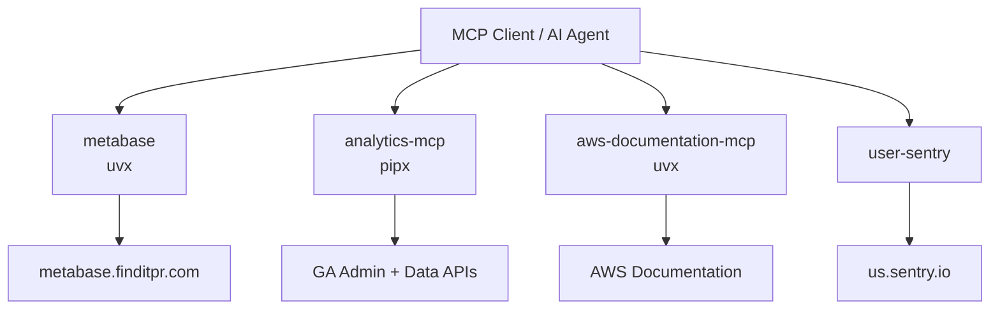
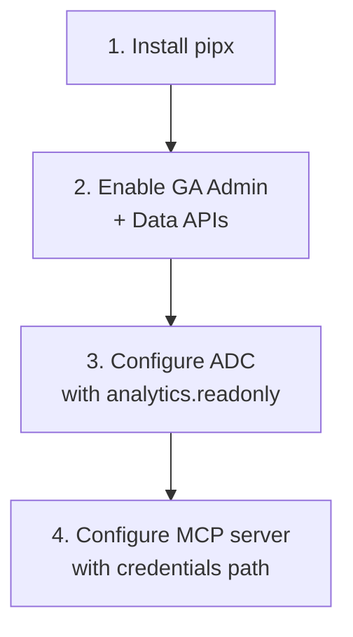
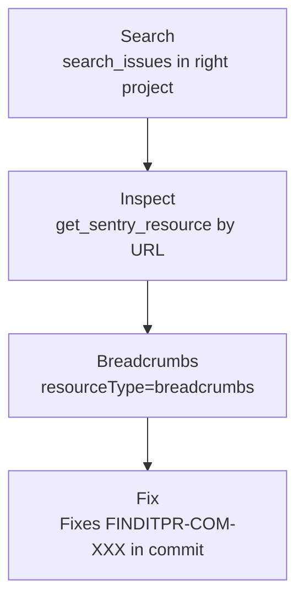

# MCP Servers & Tooling

This page documents the Model Context Protocol (MCP) servers used by the team and the tooling required to run them. It is intended as a one-stop onboarding reference for new developers and for AI agents that need to be wired up to the team's data sources — Metabase, Google Analytics, AWS documentation, and Sentry.

All four of the MCP servers below are launched by an MCP-aware client (Claude Desktop, Cursor, Copilot, etc.) via stdio. Three of them (`metabase`, `analytics-mcp`, `awslabs.aws-documentation-mcp-server`) are launched through `uvx` / `pipx`, so installing `uv` is a prerequisite on macOS.

Sources: [mcp/uvx.md](), [mcp/metabase-mcp.md](), [mcp/google-analytics-mcp.md](), [mcp/aws-docs-mcp.md](), [sentry-mcp-setup-and-usage-for-findit-pr.md]()

## Overview



Sources: [mcp/metabase-mcp.md](), [mcp/google-analytics-mcp.md](), [mcp/aws-docs-mcp.md](), [sentry-mcp-setup-and-usage-for-findit-pr.md]()

| MCP Server | Launcher | Purpose |
| --- | --- | --- |
| `metabase` | `uvx metabase-mcp` | Query Metabase at `metabase.finditpr.com` |
| `analytics-mcp` | `pipx run analytics-mcp` | Google Analytics Admin + Data APIs |
| `awslabs.aws-documentation-mcp-server` | `uvx awslabs.aws-documentation-mcp-server@latest` | Context on AWS products |
| `user-sentry` | (client-provided) | Sentry issues, events, breadcrumbs, replays |

Sources: [mcp/metabase-mcp.md](), [mcp/google-analytics-mcp.md](), [mcp/aws-docs-mcp.md](), [sentry-mcp-setup-and-usage-for-findit-pr.md]()

## Prerequisite: `uv` / `uvx` (macOS)

The Google Analytics, AWS, and Metabase MCPs use `uvx` instead of `npx`, so `uv` must be installed first.

**Install without Homebrew:**

```
curl -LsSf https://astral.sh/uv/install.sh | sh
```

**Install with Homebrew:**

```
brew install uv
```

Sources: [mcp/uvx.md]()

## Metabase MCP

Configuration snippet for clients that don't already have Metabase MCP set up. The server is launched via `uvx` and points at the team's Metabase instance.

```json
"metabase": {
  "type": "stdio",
  "command": "uvx",
  "args": ["metabase-mcp"],
  "env": {
    "METABASE_URL": "https://metabase.finditpr.com",
    "METABASE_API_KEY": "<your-api-key>"
  }
}
```

Sources: [mcp/metabase-mcp.md]()

## Google Analytics MCP

Exposes Google Analytics data to LLMs via the Google Analytics Admin API and Google Analytics Data API.

### Tools

| Category | Tool | Description |
| --- | --- | --- |
| Account/property | `get_account_summaries` | GA accounts and properties for the user |
| Account/property | `get_property_details` | Details about a property |
| Account/property | `list_google_ads_links` | Google Ads account links for a property |
| Core reports | `run_report` | Run a GA report via the Data API |
| Core reports | `get_custom_dimensions_and_metrics` | Custom dimensions/metrics for a property |
| Realtime | `run_realtime_report` | Run a realtime GA report |

Sources: [mcp/google-analytics-mcp.md]()

### Setup



Sources: [mcp/google-analytics-mcp.md]()

**1. Python** — install `pipx`.

**2. Enable APIs** — enable the Google Analytics Admin API and the Google Analytics Data API in your Google Cloud project.

**3. Credentials** — configure Application Default Credentials (ADC) for a user with access to your GA accounts/properties. Credentials must include the read-only scope:

```
https://www.googleapis.com/auth/analytics.readonly
```

Service-account impersonation is the **recommended** approach — the plain user-credentials option signs out every hour:

```shell
gcloud auth application-default login \
  --impersonate-service-account=SERVICE_ACCOUNT_EMAIL \
  --scopes=https://www.googleapis.com/auth/analytics.readonly,https://www.googleapis.com/auth/cloud-platform
```

The alternative, using an OAuth desktop/web client JSON:

```shell
gcloud auth application-default login \
  --scopes https://www.googleapis.com/auth/analytics.readonly,https://www.googleapis.com/auth/cloud-platform \
  --client-id-file=YOUR_CLIENT_JSON_FILE
```

Copy the `PATH_TO_CREDENTIALS_JSON` printed when the command finishes — you need it for the MCP config.

Sources: [mcp/google-analytics-mcp.md]()

**4. MCP configuration** — adding `GOOGLE_CLOUD_PROJECT` is recommended:

```json
{
  "mcpServers": {
    "analytics-mcp": {
      "command": "pipx",
      "args": ["run", "analytics-mcp"],
      "env": {
        "GOOGLE_APPLICATION_CREDENTIALS": "PATH_TO_CREDENTIALS_JSON",
        "GOOGLE_PROJECT_ID": "YOUR_PROJECT_ID"
      }
    }
  }
}
```

Sample prompts to validate the install: `what can the analytics-mcp server do?`, `Give me details about my Google Analytics property with 'xyz' in the name`, `what are the most popular events in my Google Analytics property in the last 180 days?`.

Sources: [mcp/google-analytics-mcp.md]()

## AWS Docs MCP

Gives AI agents better context on how AWS products work.

```json
"awslabs.aws-documentation-mcp-server": {
  "command": "uvx",
  "args": ["awslabs.aws-documentation-mcp-server@latest"],
  "env": {
    "FASTMCP_LOG_LEVEL": "ERROR",
    "AWS_DOCUMENTATION_PARTITION": "aws"
  },
  "disabled": false,
  "autoApprove": []
}
```

Sources: [mcp/aws-docs-mcp.md]()

## Sentry MCP

The Sentry MCP server (`user-sentry`) provides structured access to issues, events, breadcrumbs, and replays without needing to parse the Sentry web UI.

### Organization Details

| Detail | Value |
| --- | --- |
| Org slug | `bluepath-group-llc` |
| Region URL | `https://us.sentry.io` |
| API project | `finditpr-nestjs` (NestJS backend errors) |
| Frontend project | `finditpr-com` (Next.js SSR + client errors) |

Sources: [sentry-mcp-setup-and-usage-for-findit-pr.md]()

### Key Tools

**`search_issues`** — find issues by natural-language description, scoped to a project.

```
search_issues(
  organizationSlug='bluepath-group-llc',
  naturalLanguageQuery='unresolved 500 errors on blog',
  projectSlugOrId='finditpr-com',
  regionUrl='https://us.sentry.io'
)
```

Gotcha: does **not** support `OR`/`AND` boolean operators — use separate calls instead.

**`get_sentry_resource`** — full issue details from a URL. Returns error message, stacktrace, tags, HTTP request details, related replays.

```
get_sentry_resource(url='https://bluepath-group-llc.sentry.io/issues/FINDITPR-COM-139/')
```

**`get_sentry_resource` with `resourceType='breadcrumbs'`** — the trail of API calls, console logs, and HTTP requests leading to the crash.

```
get_sentry_resource(
  url='https://bluepath-group-llc.sentry.io/issues/FINDITPR-COM-139/',
  resourceType='breadcrumbs'
)
```

The `digest` field is especially useful for Next.js errors:

| `digest` value | Meaning |
| --- | --- |
| `DYNAMIC_SERVER_USAGE` | dynamic API called during static render |
| `NEXT_NOT_FOUND` | `notFound()` was called |
| `NEXT_REDIRECT` | `redirect()` was called |

**`search_events`** — aggregate counts and stats. Use this for counts/aggregations instead of `search_issues`.

```
search_events(
  organizationSlug='bluepath-group-llc',
  projectSlugOrId='finditpr-com',
  naturalLanguageQuery='count of 500 errors today'
)
```

Sources: [sentry-mcp-setup-and-usage-for-findit-pr.md]()

### Investigation Workflow



1. **Search** — `search_issues` scoped to the right project (`finditpr-com` for frontend, `finditpr-nestjs` for API).
2. **Inspect** — `get_sentry_resource` with the issue URL for full error details.
3. **Breadcrumbs** — `get_sentry_resource` with `resourceType='breadcrumbs'` to see the events leading to the crash.
4. **Fix** — reference the issue ID in commit messages (`Fixes FINDITPR-COM-XXX`) to auto-close on merge.

Sources: [sentry-mcp-setup-and-usage-for-findit-pr.md]()

### Tips

- Production Next.js builds hide the real error behind a generic message — always check breadcrumbs for the `digest` value.
- Filter by `environment` tag (`staging` vs `production`) when searching.
- The frontend project captures both client-side and SSR errors — check the `transaction` tag to see which route triggered it (e.g., `GET /[locale]/blog/[slug]/page`).
- If `search_issues` returns nothing, broaden the query or check the other project (`finditpr-nestjs` vs `finditpr-com`).

Sources: [sentry-mcp-setup-and-usage-for-findit-pr.md]()

## Summary

For a working setup: install `uv` (macOS), drop the Metabase and AWS Docs configs into your MCP client, go through the four-step Google Analytics setup to get ADC credentials, and point `user-sentry` at the `bluepath-group-llc` organization. Once all four are wired up, an AI agent has direct access to product analytics, BI queries, AWS reference docs, and production error telemetry.

Sources: [mcp/uvx.md](), [mcp/metabase-mcp.md](), [mcp/google-analytics-mcp.md](), [mcp/aws-docs-mcp.md](), [sentry-mcp-setup-and-usage-for-findit-pr.md]()