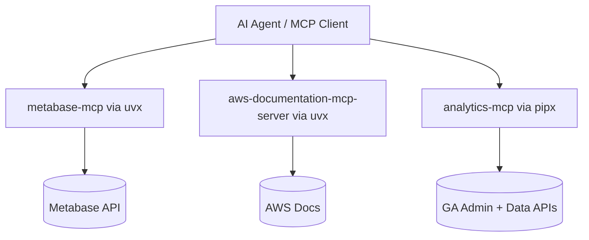
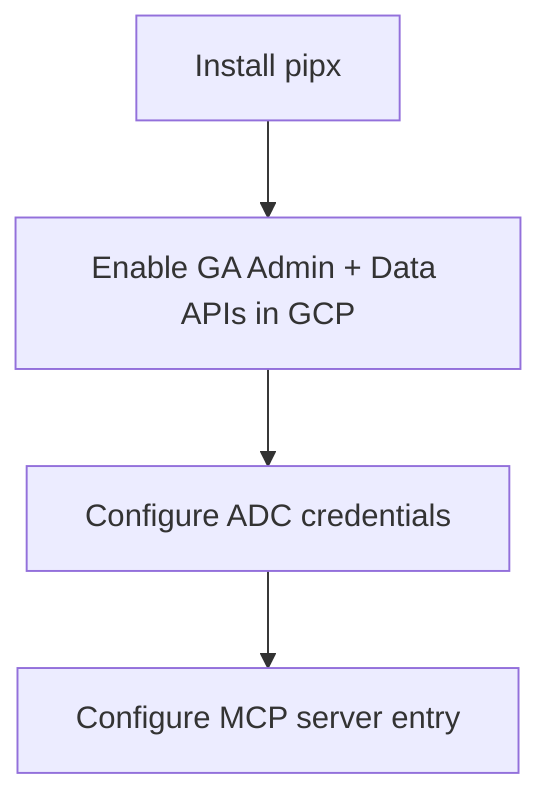

# MCP Tooling Setup

This page documents the Model Context Protocol (MCP) servers the team uses to extend AI agents with access to internal and external data sources — Metabase, AWS Documentation, and Google Analytics. It also covers the prerequisite CLI tooling (`uv`/`uvx`) needed to run most of these servers.

Use this page as the starting point when configuring a new AI agent or onboarding a teammate who needs their assistant to query Metabase, look up AWS docs, or pull Google Analytics data.

Sources: [mcp/metabase-mcp.md](), [mcp/aws-docs-mcp.md](), [mcp/google-analytics-mcp.md](), [mcp/uvx.md]()

## Overview

The team currently runs three MCP servers. Two of them (Metabase, AWS Docs) launch via `uvx`, and one (Google Analytics) launches via `pipx`. All are configured as `stdio` entries in the MCP client's server configuration.



Sources: [mcp/metabase-mcp.md](), [mcp/aws-docs-mcp.md](), [mcp/google-analytics-mcp.md]()

## Prerequisite: Installing `uv` / `uvx` (macOS)

The Google Analytics, AWS and Metabase MCPs use `uvx` instead of `npx`, so `uv` must be installed first.

### Without Homebrew

```
curl -LsSf https://astral.sh/uv/install.sh | sh
```

### With Homebrew

```
brew install uv
```

Note: although the `uvx.md` note lists the Google Analytics MCP among `uvx`-based servers, the actual GA setup instructions in this wiki use `pipx run analytics-mcp`. See the [Google Analytics MCP Server](#google-analytics-mcp-server) section below.

Sources: [mcp/uvx.md](), [mcp/google-analytics-mcp.md]()

## Metabase MCP

The Metabase MCP server lets agents query the team's Metabase instance. Use this configuration when a teammate requesting knowledge does not already have Metabase wired up.

### Configuration

```json
"metabase": {
  "type": "stdio",
  "command": "uvx",
  "args": ["metabase-mcp"],
  "env": {
    "METABASE_URL": "https://metabase.finditpr.com",
    "METABASE_API_KEY": "<your-api-key>"
  }
}
```

| Field | Value |
|---|---|
| `command` | `uvx` |
| `args` | `["metabase-mcp"]` |
| `METABASE_URL` | `https://metabase.finditpr.com` |
| `METABASE_API_KEY` | Your personal Metabase API key |

Sources: [mcp/metabase-mcp.md]()

## AWS Docs MCP

The AWS Docs MCP server gives AI agents better context on how AWS products work by exposing AWS documentation search/retrieval to the agent.

### Configuration

```json
"awslabs.aws-documentation-mcp-server": {
  "command": "uvx",
  "args": ["awslabs.aws-documentation-mcp-server@latest"],
  "env": {
    "FASTMCP_LOG_LEVEL": "ERROR",
    "AWS_DOCUMENTATION_PARTITION": "aws"
  },
  "disabled": false,
  "autoApprove": []
}
```

| Env var | Purpose |
|---|---|
| `FASTMCP_LOG_LEVEL` | Server log verbosity (`ERROR` by default) |
| `AWS_DOCUMENTATION_PARTITION` | AWS partition to query (`aws`) |

Sources: [mcp/aws-docs-mcp.md]()

## Google Analytics MCP Server

Exposes Google Analytics data to LLMs via the Google Analytics Admin API and Google Analytics Data API.

### Tools provided

Account and property information:
- `get_account_summaries` — information about the user's GA accounts and properties.
- `get_property_details` — details about a property.
- `list_google_ads_links` — links to Google Ads accounts for a property.

Core reports:
- `run_report` — runs a GA report via the Data API.
- `get_custom_dimensions_and_metrics` — custom dimensions and metrics for a property.

Realtime reports:
- `run_realtime_report` — runs a GA realtime report via the Data API.

Sources: [mcp/google-analytics-mcp.md]()

### Setup flow



Sources: [mcp/google-analytics-mcp.md]()

### 1. Configure Python

Install `pipx` (see the pipx project docs).

### 2. Enable APIs

In your Google Cloud project, enable:
- Google Analytics Admin API
- Google Analytics Data API

### 3. Configure credentials

Set up Application Default Credentials (ADC). Credentials must be for a user with access to your GA accounts/properties and must include the read-only scope:

```
https://www.googleapis.com/auth/analytics.readonly
```

Two `gcloud` options are documented:

**User credentials with an OAuth desktop/web client:**

```shell
gcloud auth application-default login \
  --scopes https://www.googleapis.com/auth/analytics.readonly,https://www.googleapis.com/auth/cloud-platform \
  --client-id-file=YOUR_CLIENT_JSON_FILE
```

**Service account impersonation (recommended — the other option signs out every hour):**

```shell
gcloud auth application-default login \
  --impersonate-service-account=SERVICE_ACCOUNT_EMAIL \
  --scopes=https://www.googleapis.com/auth/analytics.readonly,https://www.googleapis.com/auth/cloud-platform
```

When the command completes, copy the `PATH_TO_CREDENTIALS_JSON` path printed to the console — you'll need it below.

Sources: [mcp/google-analytics-mcp.md]()

### 4. Configure the MCP server

Replace `PATH_TO_CREDENTIALS_JSON` with the path from the previous step, and `YOUR_PROJECT_ID` with your Google Cloud project ID. Adding `GOOGLE_CLOUD_PROJECT` to `env` is recommended.

```json
{
  "mcpServers": {
    "analytics-mcp": {
      "command": "pipx",
      "args": [
        "run",
        "analytics-mcp"
      ],
      "env": {
        "GOOGLE_APPLICATION_CREDENTIALS": "PATH_TO_CREDENTIALS_JSON",
        "GOOGLE_PROJECT_ID": "YOUR_PROJECT_ID"
      }
    }
  }
}
```

Sources: [mcp/google-analytics-mcp.md]()

### Sample prompts

Once connected, useful prompts include:

- `what can the analytics-mcp server do?`
- `Give me details about my Google Analytics property with 'xyz' in the name`
- `what are the most popular events in my Google Analytics property in the last 180 days?`
- `were most of my users in the last 6 months logged in?`
- `what are the custom dimensions and custom metrics in my property?`

Sources: [mcp/google-analytics-mcp.md]()

## Summary of MCP Servers

| Server | Launcher | Auth | Primary use |
|---|---|---|---|
| `metabase` | `uvx metabase-mcp` | `METABASE_API_KEY` | Query team Metabase |
| `awslabs.aws-documentation-mcp-server` | `uvx awslabs.aws-documentation-mcp-server@latest` | None | AWS docs lookup |
| `analytics-mcp` | `pipx run analytics-mcp` | Google ADC | Google Analytics data |

Sources: [mcp/metabase-mcp.md](), [mcp/aws-docs-mcp.md](), [mcp/google-analytics-mcp.md]()