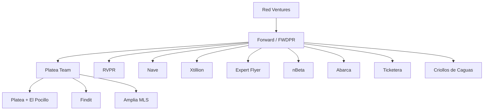

# Overview & Organization

This page introduces the Platea team, its position within the Forward (FWDPR) business community and Red Ventures, and the set of products the team owns and operates. It serves as the entry point to the Platea knowledge base, orienting readers before they dive into product-specific or tooling-specific pages.

Sources: [general-knowledge.md](), [domain-knowledge/foward787.md](), [domain-knowledge/platea.md]()

## Organizational Context

The Platea team is part of **Red Ventures** and operates within the **Forward (FWDPR)** business community. Forward provides access to a broader portfolio of sibling companies, enabling potential collaboration and shared resources across the ecosystem.

Forward is a Puerto Rico–based business community and ecosystem founded in 2018 in the aftermath of Hurricane María, with the goal of revitalizing the island's economy. Its mission is to attract and nurture talent in Puerto Rico, position the island as a hub for innovation, and drive economic growth through community building and social impact. Forward's portfolio spans industries including finance, data, marketing, real estate, entertainment, sports, and consumer marketplaces. Website: https://www.fwdpr.com/

Sources: [general-knowledge.md](), [domain-knowledge/foward787.md]()

### Forward Portfolio and Sibling Companies

Forward brings together a portfolio of companies and brands that work collaboratively under the Forward umbrella, sharing a commitment to excellence and delivering value to consumers and partners:

- RVPR
- Nave
- Xtillion
- **Platea** (this team)
- Expert Flyer
- nBeta
- Abarca
- Ticketera
- **Findit** (operated by Platea team)
- **Amplia MLS** (operated by Platea team)
- Criollos de Caguas

Sources: [domain-knowledge/foward787.md](), [general-knowledge.md]()

### Organizational Relationships

Sources: [general-knowledge.md](), [domain-knowledge/foward787.md]()

## Products Operated by the Platea Team

The Platea team operates three products:

| Product | Surface | Notes |
|---|---|---|
| **Platea** | plateapr.com | Brand site plus "El Pocillo," Platea's daily email newsletter |
| **Findit** | finditpr.com | — |
| **Amplia MLS** | ampliamls.com | Shares AWS infrastructure with Findit |

Sources: [general-knowledge.md]()

### Platea

Platea is a platform that helps users discover what to do, what to eat, and what to know in Puerto Rico. It serves as a local guide for both locals and tourists. One of Platea's most important products is **El Pocillo**, a daily newsletter that gets users up to speed with the most relevant news in Puerto Rico, with more than **50,000 subscribers**.

Platea has a solid social media presence, with over 270,000 followers on Facebook, 283,000 on Instagram, 65,000 on TikTok, 1,800 on YouTube, and 800 on LinkedIn as of April 1, 2026. Its website, plateapr.com, averages over 150K monthly sessions as of the same date.

Sources: [domain-knowledge/platea.md]()

### Findit and Amplia MLS

Findit (finditpr.com) and Amplia MLS (ampliamls.com) are the team's two real-estate-oriented products. They share the same AWS infrastructure, which is reflected in how access is scoped through the AWS CLI (see below).

Sources: [general-knowledge.md]()

## Infrastructure Boundaries

The team's AWS accounts are split along product lines, with Findit and Amplia sharing one account:

| AWS CLI Profile | Covers |
|---|---|
| `--profile=plateapr.com` | Platea |
| `--profile=finditpr.com` | Findit **and** Amplia MLS (shared infra) |

Sources: [general-knowledge.md]()

## Tooling Map by Product

Different tools and MCP servers apply to different products. The matrix below summarizes which backends and analytics surfaces are relevant for each product; tool-specific usage details live on their own pages.

| Product | Metabase DB | Iterable | GA Property |
|---|---|---|---|
| Platea (plateapr.com + El Pocillo) | — | ✓ | `properties/264907762` |
| Findit (finditpr.com) | `find-it-prod` (MySQL) | — | `properties/348391748` |
| Amplia MLS (ampliamls.com) | `amplia-prod` (MySQL) | — | `properties/480299481` |

Notion MCP applies across all products (with user confirmation) for accessing technical documentation, product PRDs, deadlines, and backlogs. Iterable is used **exclusively for Platea** to send and manage "El Pocillo" and to pull engagement and performance insights.

Sources: [general-knowledge.md]()

## Knowledge Base Purpose

This knowledge base is served via **Context101**, which was created with the purpose of CRUD-ing knowledge as easily as possible and sharing that knowledge across any MCP Client (Cursor, Devin, Claude, etc.). That makes this wiki the canonical reference across tooling surfaces the team uses day-to-day.

Sources: [new-mcp.md]()