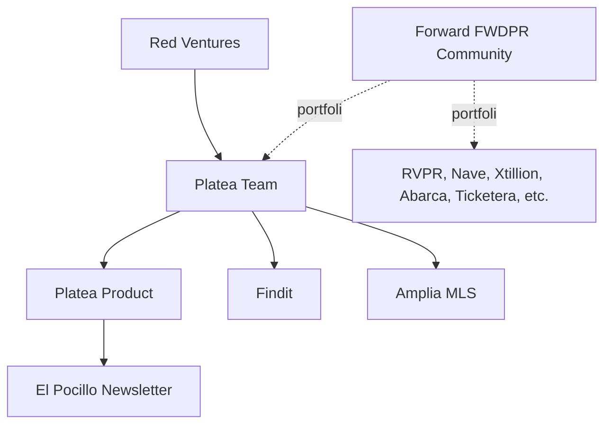
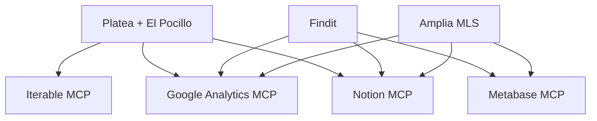

# Overview & Organizational Context

This page introduces the Platea team, its position within the Forward (FWDPR) business community, and the products the team operates. It is intended as the entry point to this knowledge base — subsequent pages go deeper into tooling, data access, and product-specific workflows.

Sources: [general-knowledge.md](), [domain-knowledge/platea.md](), [domain-knowledge/foward787.md]()

## Forward (FWDPR) — Parent Business Community

Forward (FWDPR) is a Puerto Rico–based business community and ecosystem founded in **2018** in the aftermath of Hurricane María, with the goal of revitalizing the island's economy. It brings together a portfolio of companies and brands spanning finance, data, marketing, real estate, entertainment, sports, and consumer marketplaces.

Forward's mission is to attract and nurture talent in Puerto Rico, position the island as a hub for innovation, and drive economic growth through community building and social impact. Website: https://www.fwdpr.com/

Companies and brands under the Forward umbrella include:

- RVPR
- Nave
- Xtillion
- **Platea**
- Expert Flyer
- nBeta
- Abarca
- Ticketera
- **Findit**
- **Amplia MLS**
- Criollos de Caguas

The Platea team operates within this community, which provides access to the broader portfolio for potential collaboration and shared resources. The Platea team itself is part of Red Ventures.

Sources: [domain-knowledge/foward787.md](), [general-knowledge.md]()

## The Platea Team

The Platea team operates three products. Two of them (Findit and Amplia MLS) share infrastructure, while Platea itself is distinct and includes a newsletter component.

| Product | Surface(s) | Description |
|---|---|---|
| Platea | plateapr.com + "El Pocillo" newsletter | Local guide for discovering what to do, eat, and know in Puerto Rico |
| Findit | finditpr.com | — |
| Amplia MLS | ampliamls.com | — |

Sources: [general-knowledge.md](), [domain-knowledge/platea.md]()

### Platea (Product)

Platea is a platform that helps users discover what to do, what to eat, and what to know in Puerto Rico, serving as a local guide for both locals and tourists. One of its most important products is **El Pocillo**, a daily newsletter that covers the most relevant news in Puerto Rico, with more than **50,000 subscribers**.

As of April 1, 2026, Platea maintains a strong social footprint:

| Channel | Followers / Sessions |
|---|---|
| Facebook | 270,000+ |
| Instagram | 283,000 |
| TikTok | 65,000 |
| YouTube | 1,800 |
| LinkedIn | 800 |
| plateapr.com (monthly sessions) | 150K+ |

Sources: [domain-knowledge/platea.md]()

### Findit and Amplia MLS

Findit (finditpr.com) and Amplia MLS (ampliamls.com) are the other two products operated by the team. They share the same AWS infrastructure — a key operational detail distinguishing them from Platea.

Sources: [general-knowledge.md]()

## Organizational & Product Relationships



Sources: [general-knowledge.md](), [domain-knowledge/foward787.md](), [domain-knowledge/platea.md]()

## Infrastructure and Tooling Context

The three products differ meaningfully in how they are accessed and instrumented. This context is essential before using any MCP tooling.

### AWS Profiles

Findit and Amplia share AWS infrastructure; Platea has its own.

```
--profile=finditpr.com   # Findit + Amplia (shared)
--profile=plateapr.com   # Platea
```

Sources: [general-knowledge.md]()

### MCP Tool Applicability by Product

| Product | Metabase DB | Iterable | GA Property |
|---|---|---|---|
| Platea (plateapr.com + El Pocillo) | — | ✓ | `properties/264907762` |
| Findit (finditpr.com) | `find-it-prod` (MySQL) | — | `properties/348391748` |
| Amplia MLS (ampliamls.com) | `amplia-prod` (MySQL) | — | `properties/480299481` |

- **Metabase MCP** — Required for querying backend databases (inventory, users, agents, offices, saved searches, etc.) for Findit and Amplia. Not applicable to Platea.
- **Iterable MCP** — Used **exclusively for Platea** to send and manage the El Pocillo newsletter and to pull engagement/performance insights.
- **Google Analytics MCP** — Provides traffic and performance insights for all three products, each with its own property ID.
- **Notion MCP** — Applies across all products for technical documentation, PRDs, deadlines, and backlogs. Always confirm with the user before querying Notion.

Sources: [general-knowledge.md]()

### Tool ↔ Product Map



Sources: [general-knowledge.md]()

## Knowledge Base Management

This knowledge base is managed via **Context101**, which was created with the purpose of making CRUD of knowledge as easy as possible and sharing that knowledge across any MCP Client (Cursor, Devin, Claude, etc.).

Sources: [new-mcp.md]()

## Summary

The Platea team sits within Red Ventures and participates in the Forward (FWDPR) Puerto Rico business community. It operates three products — Platea (with the El Pocillo newsletter), Findit, and Amplia MLS — each with distinct tooling and infrastructure footprints. Findit and Amplia share AWS infrastructure and rely on Metabase-backed MySQL databases, while Platea is the sole consumer of the Iterable MCP for its newsletter operations. Google Analytics and Notion span all three products.

Sources: [general-knowledge.md](), [domain-knowledge/foward787.md](), [domain-knowledge/platea.md](), [new-mcp.md]()