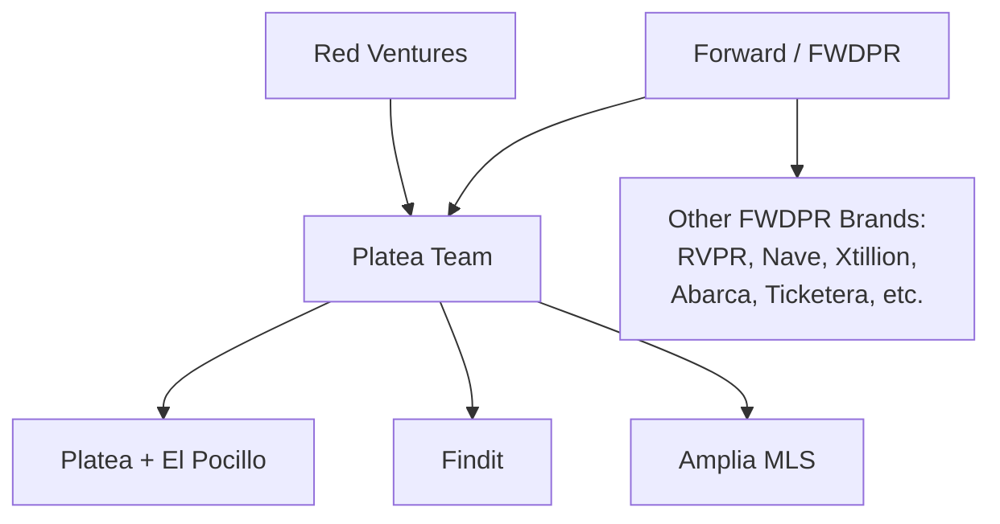
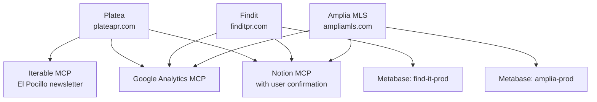

# Overview & Team Context

This page introduces the **Platea team**, its place within its parent organizations (**Red Ventures** and **Forward/FWDPR**), the products the team operates, and how those products relate to each other and to the surrounding tooling ecosystem. It is intended as the starting point for anyone onboarding to the team or trying to understand how Platea, Findit, and Amplia MLS fit together.

For deeper operational detail (tool access by product, database names, GA property IDs, etc.), follow the links throughout this page.

Sources: [general-knowledge.md](), [domain-knowledge/foward787.md]()

## Organizational Context

The Platea team is part of **Red Ventures** and operates within the **Forward (FWDPR)** business community. Forward provides access to a broader portfolio of companies for potential collaboration and shared resources.

Forward (FWDPR) is a Puerto Rico–based business community and ecosystem founded in **2018** in the aftermath of Hurricane María, with the goal of revitalizing the island's economy. Its mission is to attract and nurture talent in Puerto Rico, position the island as a hub for innovation, and drive economic growth through community building and social impact.

Forward brings together a portfolio of companies and brands across industries like finance, data, marketing, real estate, entertainment, sports, and consumer marketplaces:

- RVPR
- Nave
- Xtillion
- **Platea**
- Expert Flyer
- nBeta
- Abarca
- Ticketera
- **Findit**
- **Amplia MLS**
- Criollos de Caguas

Website: https://www.fwdpr.com/

Sources: [general-knowledge.md](), [domain-knowledge/foward787.md]()

Sources: [general-knowledge.md](), [domain-knowledge/foward787.md]()

## Products Operated by the Platea Team

The Platea team operates three products:

| Product | Surface | Notes |
|---|---|---|
| **Platea** | plateapr.com | Brand site, plus **"El Pocillo"** — Platea's daily email newsletter |
| **Findit** | finditpr.com | Consumer marketplace product |
| **Amplia MLS** | ampliamls.com | MLS product; shares AWS infrastructure with Findit |

Findit and Amplia MLS **share the same AWS infrastructure**, while Platea lives separately.

Sources: [general-knowledge.md]()

### AWS Access

Access to product infrastructure is split across two AWS CLI profiles:

- `--profile=finditpr.com` — Findit **and** Amplia (shared infra)
- `--profile=plateapr.com` — Platea

Sources: [general-knowledge.md]()

## Product-to-Tooling Relationships

Each product has a distinct combination of tools that apply to it. The most important distinctions:

- **Metabase** is used for backend database queries on Findit and Amplia MLS (both MySQL). It does **not** apply to Platea.
- **Iterable** is used **exclusively for Platea** to run "El Pocillo" and pull engagement/performance insights. It is not connected to Findit or Amplia.
- **Google Analytics** covers all three products, each with its own GA property ID.
- **Notion** applies across all products for docs, PRDs, deadlines, and backlogs — but the user should always be asked for confirmation before querying it.

### Quick Reference

| Product | Metabase DB | Iterable | GA Property |
|---|---|---|---|
| Platea (plateapr.com + El Pocillo) | — | ✓ | `properties/264907762` |
| Findit (finditpr.com) | `find-it-prod` | — | `properties/348391748` |
| Amplia MLS (ampliamls.com) | `amplia-prod` | — | `properties/480299481` |

Sources: [general-knowledge.md]()

Sources: [general-knowledge.md]()

## Knowledge Base Tooling

This knowledge base is managed via **Context101**, which was created to make CRUD of knowledge as easy as possible and to share that knowledge across any MCP Client (Cursor, Devin, Claude, etc.).

Sources: [new-mcp.md]()

## Summary

The Platea team sits under Red Ventures and within Forward (FWDPR), operating three products — Platea (plus the El Pocillo newsletter), Findit, and Amplia MLS. Findit and Amplia share AWS infrastructure and Metabase-backed MySQL databases, while Platea is the only product using Iterable (for El Pocillo). Google Analytics and Notion span all three products. This shared-but-differentiated structure drives how MCP tools, AWS profiles, and databases are selected for any given task.

Sources: [general-knowledge.md](), [domain-knowledge/foward787.md](), [new-mcp.md]()