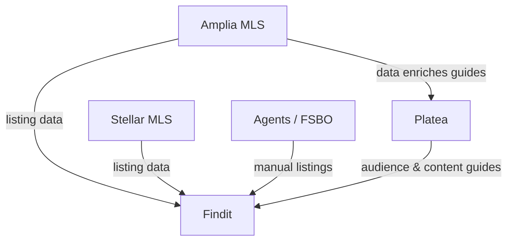

# Products & Domain Knowledge

This page describes the three core products that form the foundation of the team's work: **Platea**, **Findit**, and **Amplia MLS**. Each product serves a distinct audience in Puerto Rico, but together they form an interconnected ecosystem — Platea drives local discovery and audience reach, Findit is the consumer-facing real estate marketplace, and Amplia MLS is the data backbone that feeds Findit and enables new real estate tools.

Understanding these products — their missions, audiences, and how they relate — is foundational context for anyone working across the codebase, content, or data pipelines.

## Product Overview

| Product | Domain | Category | Key Role |
|---|---|---|---|
| Platea | plateapr.com | Local discovery & media | Content, newsletter (El Pocillo), social reach |
| Findit | finditpr.com | Real estate marketplace | Consumer-facing property search (PR-focused) |
| Amplia MLS | ampliamls.com | Multiple Listing Service | Independent MLS; data source for Findit |

Sources: [domain-knowledge/platea.md](), [domain-knowledge/findit.md](), [domain-knowledge/amplia.md]()

## Ecosystem Relationships

Amplia MLS and Stellar MLS both feed listings into Findit, alongside manual submissions from agents and For Sale by Owner (FSBO) sellers. Platea publishes guides (e.g., about buying a home) that can be enriched with Amplia data.

Sources: [domain-knowledge/findit.md](), [domain-knowledge/amplia.md]()

## Platea

Platea is a platform that helps users discover **what to do, what to eat, and what to know in Puerto Rico**. It serves as a local guide for both locals and tourists.

### El Pocillo Newsletter

El Pocillo is one of Platea's most important products — a daily newsletter that gets readers up to speed with the most relevant news in Puerto Rico. It has **more than 50,000 subscribers**.

### Reach (as of April 1, 2026)

| Channel | Audience |
|---|---|
| plateapr.com | 150K+ monthly sessions |
| El Pocillo subscribers | 50,000+ |
| Facebook | 270,000+ followers |
| Instagram | 283,000+ followers |
| TikTok | 65,000+ followers |
| YouTube | 1,800+ followers |
| LinkedIn | 800+ followers |

Sources: [domain-knowledge/platea.md]()

## Findit

Findit (finditpr.com) is a real estate marketplace **hyper-focused on the Puerto Rico market**. It displays for-sale, for-rent, and sold listings — sold is still in beta. Its current strengths are on-market properties (for sale and for rent).

### Why Findit Exists

Findit was created to give locals a better experience when searching for properties. Two market realities drove its creation:

1. **Most PR real estate agents are not Realtors**, meaning they can't use the Multiple Listing Service (MLS). Platforms like Zillow and Realtor.com rely solely on MLS feeds and therefore aren't widely used or recognized locally.
2. **Language barrier** — those platforms are English-only, while Findit offers a Spanish version by default alongside an English version.

Findit gives agents the ability to publish listings manually or through MLSs.

### Listing Sources

Findit does **not charge for publishing listings**, so anyone can publish.

### Agent Features

Findit includes a professional profile for agents, providing:

- More exposure via SEO
- A better way to showcase their listings
- A spot on Findit's directory page

### Reach (as of April 1, 2026)

| Channel | Audience |
|---|---|
| finditpr.com | 120K+ monthly sessions |
| Instagram (@findit.pr) | 70K+ followers |
| Facebook | 24K+ likes |
| TikTok (@finditpr.com) | 7K+ followers (not actively used recently) |

Sources: [domain-knowledge/findit.md]()

## Amplia MLS

Amplia MLS (ampliamls.com) is **Puerto Rico's first independent Multiple Listing Service**. Being independent allowed Amplia to set its own rules:

- **Realtor membership is not required** for agents to use the system.
- Access is **completely free**.

### Strategic Role

Puerto Rico has no centralized source for real estate data. Amplia's strategy is to capture as much data as possible to:

1. Feed Findit and make it the number one real estate marketplace on the island.
2. Build in-house real estate tools for other use cases.
3. Enrich Platea's content — for example, home-buying guides can leverage Amplia data.

Sources: [domain-knowledge/amplia.md]()

## Summary

The three products are complementary: **Platea** delivers audience, brand reach, and editorial context; **Findit** is the consumer-facing real estate product tailored to Puerto Rico's unique market (non-Realtor agents, Spanish-first); and **Amplia MLS** is the independent, free MLS that unlocks proprietary data to power both Findit and future tools. Together they address a market where neither MLS-dependent U.S. platforms nor English-only products fit local needs.

Sources: [domain-knowledge/platea.md](), [domain-knowledge/findit.md](), [domain-knowledge/amplia.md]()