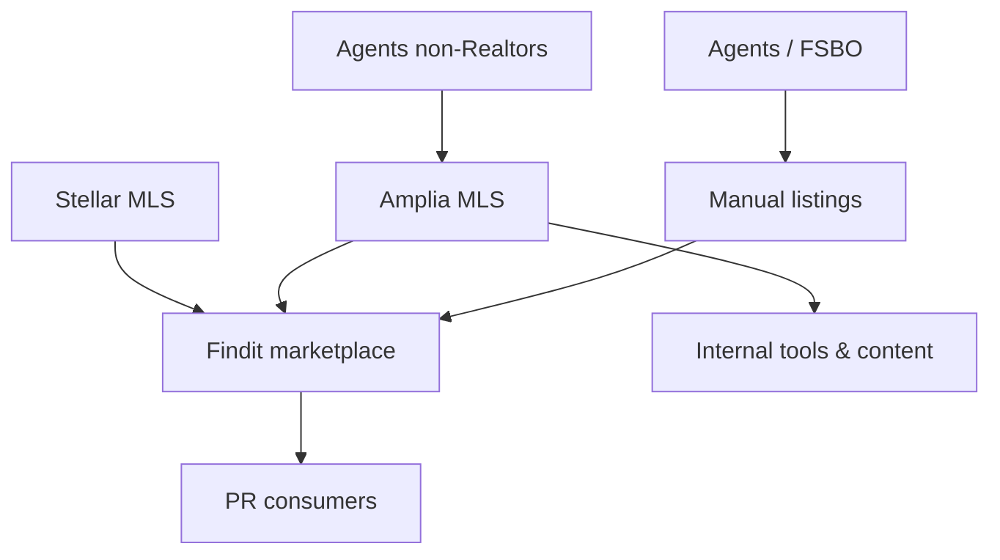

# Products: Findit & Amplia MLS

This page documents the two real estate products operated by the team: **Findit**, a consumer-facing marketplace for Puerto Rico real estate, and **Amplia MLS**, Puerto Rico's first independent Multiple Listing Service. Together, they form a vertically integrated strategy aimed at solving the structural data and access problems unique to the Puerto Rico real estate market.

Sources: [domain-knowledge/findit.md](), [domain-knowledge/amplia.md]()

## Findit (finditpr.com)

Findit is a real estate marketplace hyper-focused on the Puerto Rico market. It displays for-sale, for-rent, and sold listings — sold is still in beta, and the product's current strengths are on-market properties (for sale and for rent).

Sources: [domain-knowledge/findit.md]()

### Why Findit Exists

Findit was built to give locals a better search experience than what global platforms provide. Several structural factors in the PR market drove its creation:

- **Most PR agents are not Realtors.** Because they aren't Realtors, they cannot use the Multiple Listing Service (MLS).
- **Zillow and Realtor.com rely solely on MLS feeds.** Since most PR agents aren't on the MLS, those platforms have limited inventory and limited local recognition.
- **Language barrier.** Zillow/Realtor.com are English-only. Findit offers a Spanish version by default, along with an English version.

Findit solves this by letting agents publish listings manually or via MLS integrations.

Sources: [domain-knowledge/findit.md]()

### Listing Sources

Findit aggregates inventory from multiple sources:

| Source | Type | Notes |
|---|---|---|
| Agents | Manual entry | No fee to publish |
| FSBO sellers | Manual entry | "For Sale by Owner" |
| Stellar MLS | MLS feed | |
| Amplia MLS | MLS feed | Team's own product |

Findit does not charge for publishing listings, so anyone can publish.

Sources: [domain-knowledge/findit.md]()

### Agent Profiles

Findit includes a professional profile for agents, providing:

- Greater SEO exposure
- A better way to showcase listings
- A spot on Findit's directory page

Sources: [domain-knowledge/findit.md]()

### Reach (as of April 1, 2026)

| Channel | Metric |
|---|---|
| finditpr.com | 120K+ monthly sessions |
| Instagram (@findit.pr) | 70K+ followers |
| Facebook | 24K+ likes |
| TikTok (@finditpr.com) | 7K+ followers (not actively used) |

Sources: [domain-knowledge/findit.md]()

## Amplia MLS (ampliamls.com)

Amplia MLS is Puerto Rico's first independent Multiple Listing Service. Being independent, Amplia defines its own rules — notably:

- **No Realtor membership required** for agents to use the system.
- **Completely free** to use.

This directly addresses the gap created by the fact that most PR agents aren't Realtors and therefore can't access traditional MLSs.

Sources: [domain-knowledge/amplia.md]()

### Strategic Purpose

There is no centralized source for real estate data in Puerto Rico. The team's plan with Amplia is to capture as much data as possible in order to:

1. Feed Findit and make it the #1 real estate marketplace on the island.
2. Build internal real estate tools for other use cases. For example, Platea sometimes publishes home-buying guides, and Amplia's data can enrich that type of content.

Sources: [domain-knowledge/amplia.md]()

## Product Relationship

Findit and Amplia MLS are complementary. Amplia serves as a data-capture layer open to any agent (no Realtor requirement, no fee), while Findit is the consumer-facing marketplace that surfaces that inventory — alongside manual listings and Stellar MLS — to PR home buyers and renters.

Sources: [domain-knowledge/findit.md](), [domain-knowledge/amplia.md]()

## Market Positioning Summary

| Dimension | Findit | Amplia MLS |
|---|---|---|
| Audience | Consumers (buyers/renters) | Agents |
| URL | finditpr.com | ampliamls.com |
| Role | Marketplace | Data source / MLS |
| Cost | Free to publish | Free to use |
| Languages | Spanish (default) + English | — |
| Differentiator vs. Zillow/Realtor.com | Local focus, Spanish, non-MLS listings | Independent, no Realtor requirement |

Sources: [domain-knowledge/findit.md](), [domain-knowledge/amplia.md]()

## Summary

Findit and Amplia MLS are two halves of the same strategy: Amplia removes the structural barriers (Realtor membership, cost) that keep PR agents out of traditional MLSs, and Findit turns that captured data — together with manual listings and Stellar MLS — into a localized, bilingual marketplace tailored to Puerto Rico.

Sources: [domain-knowledge/findit.md](), [domain-knowledge/amplia.md]()