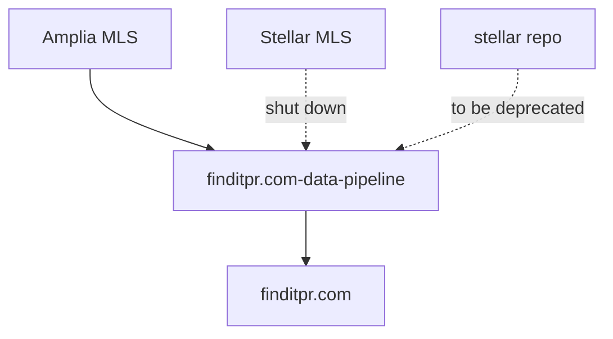
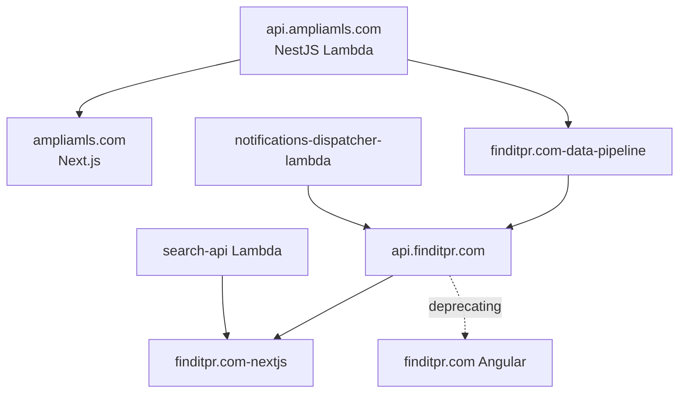

# Repositories & Codebases

This page is a directory of the GitHub repositories that power **Findit** (finditpr.com) and **Amplia MLS** (ampliamls.com). It covers backend APIs, web frontends, and the supporting Lambda services that handle notifications, search, and data ingestion, along with notes on each repo's tech stack and current deprecation status.

Use this page as the starting point for locating source code across the two products. The two products are connected: Amplia MLS data flows into Findit through a dedicated Lambda data pipeline.

Sources: [repos/findit-repos.md](), [repos/amplia-repos.md](), [wiki-test/repositories-codebases.md]()

## Findit

Findit (finditpr.com) is split across a backend API, two web frontends (one being deprecated), and a set of Lambda services for notifications, search, and data ingestion.

### Core Application

| Component | Repository | Notes |
|---|---|---|
| API backend | [jginorio/api.finditpr.com](https://github.com/jginorio/api.finditpr.com) | — |
| Web frontend (Angular) | [jginorio/finditpr.com](https://github.com/jginorio/finditpr.com) | **Being deprecated** in favor of the Next.js version |
| Web frontend (Next.js) | [jginorio/finditpr.com-nextjs](https://github.com/jginorio/finditpr.com-nextjs) | Current/target frontend |

Sources: [repos/findit-repos.md]()

### Lambdas and Services

| Service | Repository | Purpose |
|---|---|---|
| Notifications dispatcher | [jginorio/notifications-dispatcher-lambda](https://github.com/jginorio/notifications-dispatcher-lambda) | Lambda for dispatching notifications |
| Search API | [jginorio/search-api](https://github.com/jginorio/search-api) | Lambda that handles autocomplete suggestions on Findit |
| Data pipeline | [jginorio/finditpr.com-data-pipeline](https://github.com/jginorio/finditpr.com-data-pipeline) | Lambda responsible for getting Amplia MLS data into finditpr.com |
| Stellar (standalone) | [jginorio/stellar](https://github.com/jginorio/stellar) | Stellar MLS ingestion; planned for deprecation (see below) |

Sources: [repos/findit-repos.md]()

### Data Pipeline and Stellar Deprecation Plan

The `finditpr.com-data-pipeline` repo is intended to be the single entry point for ingesting MLS data into Findit. The Stellar integration inside this repo is **currently shut down**. Once it is turned back on, the standalone `stellar` repo can be gracefully deprecated and everything consolidated under `finditpr.com-data-pipeline`, since Stellar MLS data is ingested in essentially the same way as Amplia MLS data.

Sources: [repos/findit-repos.md](), [wiki-test/repositories-codebases.md]()

## Amplia MLS

Amplia MLS (ampliamls.com) consists of a NestJS Lambda backend and a Next.js frontend.

| Component | Repository | Stack |
|---|---|---|
| Backend | [jginorio/api.ampliamls.com](https://github.com/jginorio/api.ampliamls.com) | NestJS Lambda backend |
| Frontend | [jginorio/ampliamls.com](https://github.com/jginorio/ampliamls.com) | Next.js frontend |

Sources: [repos/amplia-repos.md]()

## Cross-Product Relationships

Findit and Amplia MLS are connected through the Findit data pipeline: Amplia MLS is a data source consumed by `finditpr.com-data-pipeline`, which loads listings into finditpr.com. The Findit Next.js frontend is backed by `api.finditpr.com`, with `search-api` providing autocomplete and `notifications-dispatcher-lambda` handling notifications.

Sources: [repos/findit-repos.md](), [repos/amplia-repos.md](), [wiki-test/repositories-codebases.md]()

## Tech Stack Summary

| Product | Backend | Frontend |
|---|---|---|
| Findit | API backend (`api.finditpr.com`) + Lambdas (notifications, search, data pipeline) | Next.js (`finditpr.com-nextjs`); Angular (`finditpr.com`) being deprecated |
| Amplia MLS | NestJS Lambda (`api.ampliamls.com`) | Next.js (`ampliamls.com`) |

Sources: [repos/findit-repos.md](), [repos/amplia-repos.md]()

## Summary

Findit's codebase is a multi-repo setup with an API backend, two frontends in transition (Angular → Next.js), and three Lambda services covering notifications, search autocomplete, and MLS data ingestion. Amplia MLS is a simpler two-repo product (NestJS Lambda + Next.js). The two products intersect at `finditpr.com-data-pipeline`, which is also the planned consolidation point for Stellar MLS ingestion once that integration is reactivated.

Sources: [repos/findit-repos.md](), [repos/amplia-repos.md]()